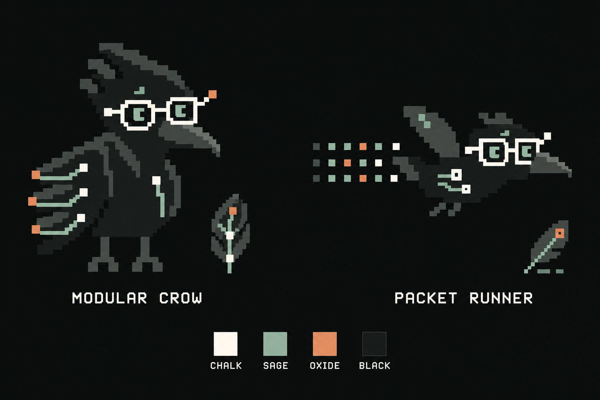

# Crowbo brand decisions

This document records selected identity elements. Earlier concept sheets and typography comparisons remain exploration history.

## Selected mascot

Selected by the user on 24 September 2026: **04 Modular Crow** from the bottom-left of the [six-tier comparison board](crow-concepts/2026-09-24/pixel-tiers/crowbo-six-pixel-tiers-board-v1.png), with **06 Packet Runner**, at bottom-right, as its companion. Modular Crow is the primary character and the opening-slide replacement. Packet Runner supplies the flying pose and packet-trail direction, with dedicated slide versions to follow the chosen slide compositions.

Keep the compact full body, stepped crest, long dark beak, expressive sage eyes, chalk circuit glasses and broad pixel shapes. The selected board's Modular Crow has three branching wing feathers with connection endpoints. It differs from the earlier individual draft's stacked wing segments. The selected [four-colour specimen](crow-concepts/2026-09-24/modular-crow/modular-packet-chalk-sage-oxide-v1.png) below carries those characters into the approved palette and is the current visual reference for dedicated assets.

The [six-tier study and generation record](crow-concepts/2026-09-24/pixel-tiers/README.md) preserve the progression; the [four-colour generation record](crow-concepts/2026-09-24/modular-crow/README.md) records the chosen palette specimen. These are presentation specimens with labels, not transparent production masters or measured native-grid sprite assets. The earlier Archivist designs remain exploration and implementation history. Dedicated [website assets and generation prompts](crow-concepts/2026-09-24/modular-crow/website/README.md) now supply the local homepage character, favicon and two matching feather sheets. Deck assets follow the application rule below.

### Deck application

The user has selected the deck's compositions. Preserve the earlier alternatives and retain the selected copy and claim qualifications when updating the identity. Modular Crow remains the opening character. Packet Runner is a recurring character in the upper-right of most supporting slides, with a small family of related wing poses and modest size variation. Keep its placement clear of titles and diagrams, generally facing into the slide. Dedicated transparent exports use solid sprite interiors and crisp pixel edges.

Oxide must be visible across the presentation, beyond small details in the crow. Use it for selected actions, decision outputs, important figures and occasional full-slide backgrounds with dark text. Sage supports evidence, context and infrastructure; chalk supplies light surfaces and strong contrast; black anchors the composition. Balance the deck visually rather than giving every colour equal area on every slide. Inspect the actual slide compositions before treating a revision as ready for review.

### Earlier Circuit Frames V3 implementation

The [refined Circuit Frames V3 source](crow-concepts/2026-09-22/circuit-frames/archivist-circuit-frames-v3.png) was selected on 22 September. Its [generation record](crow-concepts/2026-09-22/circuit-frames/archivist-circuit-frames-v3-prompt.md), [homepage/terminal copy](homepage-mockups/2026-09-21/assets/crowbo-circuit-frames-v3.png) and [typography copy](typography/2026-09-21/assets/crowbo-circuit-frames-v3.png) remain available for earlier previews. They are not the new Modular Crow master.

The earlier source PNG is 1254 × 1254 and includes a presentation caption. Its integration used **x 100, y 160, width 1000, height 950**, excluding the caption. The CSS viewport used aspect ratio `1000 / 950`, image width `125.4%`, left offset `-10%` and top offset `-16.842105%`; the terminal byte sampler read that rectangle. These crop values do not apply to the new character. Inspect each consuming preview before migrating it.

The terminal study defaults to a sprite, reveals bytes on hover, restores the sprite on leaving and has a brief peck on click/tap. Explicit sprite/bytes controls and effects-off behaviour remain part of that earlier interaction study.

### Earlier favicon

The earlier [Circuit Frames V3 head icon](crow-concepts/2026-09-22/circuit-frames/archivist-circuit-favicon-v3.png) retains lemon gate-shaped spectacles and mint eyes on midnight. Its [generation prompt](crow-concepts/2026-09-22/circuit-frames/archivist-circuit-favicon-v3-prompt.md), [actual-size preview](homepage-mockups/2026-09-21/terminal-prototype/favicon-preview.html), [homepage/terminal copy](homepage-mockups/2026-09-21/assets/crowbo-circuit-favicon-v3.png) and [typography copy](typography/2026-09-21/assets/crowbo-circuit-favicon-v3.png) remain implementation references. The current homepage uses the [Modular Crow head icon](crow-concepts/2026-09-24/modular-crow/website/crowbo-modular-favicon-v1.png); historical previews retain their earlier icons.

### State pose candidates

On 29 September 2026, eleven [state poses](crow-concepts/2026-09-29/state-poses/README.md) were generated from the approved Modular Crow and Packet Runner: inspecting, weighing, challenging, unresolved, resting, pointing, carrying a feather, a pair, a runner with a record, an expression sheet and a size ladder. They are candidates awaiting selection. The product uses none of them. Their pixel grid is approximate, so a selected pose needs a redraw on a native grid before it becomes a sprite.

## Wordmark and palette

The selected wordmark remains lowercase **crowbo** in Geist Pixel Square, weight 400, letter spacing -0.04em, with plain light lettering and no glow or shadow. The [typography study](typography/2026-09-21/README.md) owns the type selection record and font licensing notes.

On 24 September, the user selected Modular Crow and requested the new four-colour identity for the deck. Chalk, sage, black and warm oxide are the selected palette, with oxide given a more visible role in the deck application above.

| Colour | Target token | Use | Status |
| --- | --- | --- | --- |
| Chalk white | `#F5F3E8` | Glasses and strongest light details | Selected core colour |
| Sage | `#91AA9D` | Eyes and infrastructure paths | Selected core colour |
| Near-black | `#171B1A` | Crow body and main dark shapes | Selected core colour |
| Warm oxide | `#D18A66` | Sparse mascot terminals and packets; visible decision highlights and warm presentation surfaces | Selected accent |

Charcoal `#38413C` supplies neutral shade planes and `#0C1010` is the study background. These are supporting values, not extra signature accents. The generated raster contains additional shades; hex values are design targets. Keep chalk white as the strongest contrast on the face. Oxide occupies a small share of the artwork and leaves the main frames white.

The [four-colour Modular Crow and Packet Runner specimen](crow-concepts/2026-09-24/modular-crow/README.md) records the selected mascot balance and its exact prompt. The homepage uses dedicated exports from this direction. Transparent Packet Runner exports and the selected deck revision are held in the private design workspace and handed to Steerer; private presentation material stays outside this public repository. Earlier purple, mint, lemon and ivory tokens remain in historical previews until those applications are updated.

### Presentation backgrounds

The earlier presentation direction, selected on 22 September, used crow purple `#28243E` or mint green `#A4EDC3` backgrounds, with warm ivory `#F3E9D5` or mint text on purple and crow purple text on mint. Lemon `#EEF34B` was an accent; midnight was `#10101B`. Those are historical tokens. The selected deck uses black, chalk, sage and oxide. Use dark text on sage or oxide surfaces and chalk or oxide text on the dark background; choose each pairing for readable contrast in its composition.

## Interface rules

Added 29 September 2026 by the [unslop pass](decision-studio/UNSLOP-PASS.md). The four selected colours and the type selection above are unchanged. These rules apply them to the interface and are enforced by `decision-studio/tests/brand-tokens.test.mjs`.

| Rule | Detail |
| --- | --- |
| Tokens | Stylesheets take every colour from `decision-studio/src/tokens.css`: a neutral ramp from black to chalk and an oxide ramp, 23 colour tokens in total. Steps between the selected colours are interpolations, not new brand colours. |
| Corners | Square. Primary buttons and tags take a stepped corner one grid pixel deep. One grid pixel is 4 CSS pixels. |
| Shadows | Floating layers cast one hard offset shadow. Panels in the page cast none. |
| Overlays | A flat scrim. No blur. |
| Marks | Squares. No circles. |
| Icons | Thirty-one icons drawn on an 8 by 8 grid in `decision-studio/src/pixel-icons.tsx`, rendered at 16, 24 or 32 pixels. |
| Text size | Nothing below 10 pixels. |
| Copy | A line says what the thing is or does. |

The [brand system page](decision-studio/brand/index.html) renders all of this from the live tokens, icons and artwork. It builds to `/brand/`, unlisted and marked `noindex`.

Two observations are recorded for a later decision and changed nothing: Space Grotesk and Bricolage Grotesque are common in generated interfaces, and the landing page sets body copy in a system serif that the demo does not use.

## Website direction

Selected by the user on 23 September 2026 after reviewing Cursive and Praxic: a short company introduction with minimal product detail. Use the existing lowercase wordmark at a large size, readable editorial body copy, generous space and one contact link. On 24 September, the user approved the broader company copy led by "The decision engine for security teams." The introduction now names humans and agents as the intended users making and explaining those choices in business context, then revisiting them as things change.

The default illustration uses twelve pixel feather designs inside the restored boxed topology. Subtle feather movement, travelling bytes and hover or keyboard selection make the page interactive. A small Pause/Play control remains available. The diagram is labelled illustrative; its sizes and paths are authored visual choices. The first workflow, detailed synthetic scenarios and design comparison controls stay in explicit preview URLs.

The [company homepage prototype](homepage-mockups/2026-09-21/homepage-prototype/README.md) owns the full copy, feather mappings and visual checks. The user supplied `enquiries@crowbo.ai` for the contact link. On 24 September the local homepage was updated to the selected four-colour identity: Modular Crow at the top right of the masthead above the boxed network, matching dark feather artwork, a new head favicon, sage connections and oxide interaction accents. Portrait and Flock previews also use the standalone Modular Crow source. This remains a local preview, not a deployment.

## Decision Studio application

The [29 September product study](decision-studio/README.md) applies this identity to Decisions, Sources, People and History. Navigation uses plain language; the crow and feathers carry the visual identity. Modular Crow anchors the expandable boxed source network; Packet Runner appears in the upper-right of page headings, facing inward. Six source families from the twelve-feather library appear in the map, collection, inspector and people context. Their authored circuits illustrate relationships, not measured weights or live data movement.

The study uses Geist Pixel Square for the existing lowercase wordmark, Departure Mono for terminal labels, Bricolage Grotesque for headings and Space Grotesk for reading. All four come from the existing licensed typography collection. Chalk makes the proposed recommendation readable; sage carries source context; oxide marks selection, corrections and the next action. Keep the dark base neutral and the wordmark free of glow or shadow.

Short page transitions, feather scans, travelling packets and occasional crow movement support exploration. Text remains readable throughout, with a motion pause control and reduced-motion handling. Provider marks identify illustrative sources and do not imply active integrations. The [studio README](decision-studio/README.md) owns current verification receipts and links the earlier visual research; the [interaction model](../docs/INTERACTION-MODEL.md) owns the workflow meanings.
