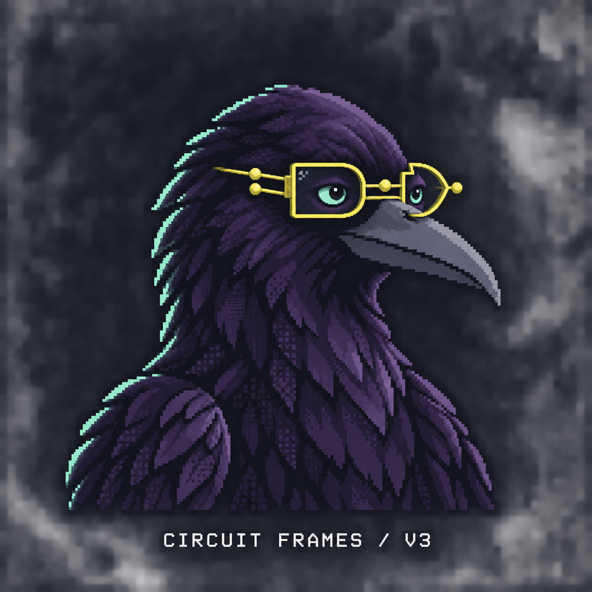

# Crowbo brand decisions

This document records selected identity elements. Earlier concept sheets and typography comparisons remain exploration history.

## Mascot

Selected by the user on 22 September 2026: **the Archivist — Circuit Frames V3 (refined)**. This replaces the earlier round-glasses Archivist and all previous mascot candidates in current brand applications.

The selected artwork is [archivist-circuit-frames-v3.png](crow-concepts/2026-09-22/circuit-frames/archivist-circuit-frames-v3.png), not the similarly named draft. It keeps adult crow proportions, dark violet plumage and the mint outer-left feather edge. More open mint eyes bring expression; block and dither feather texture gives it a terminal character. The lemon spectacles have AND/OR-shaped rims, round circuit terminals, a bridge, hinge and receding temple arm. They read as wearable glasses.

The [generation record](crow-concepts/2026-09-22/circuit-frames/archivist-circuit-frames-v3-prompt.md) preserves the edits and refinement prompt. Use this selected source for future assets. Earlier concept sheets and the V3 draft remain history, not alternative current masters.

The [homepage and terminal runtime copy](homepage-mockups/2026-09-21/assets/crowbo-circuit-frames-v3.png) and [typography runtime copy](typography/2026-09-21/assets/crowbo-circuit-frames-v3.png) are byte-identical to the selected source. Each local preview is independently served, so it carries its own local assets. Replace both copies together when the selected master changes.

The source PNG is 1254 × 1254 and includes a presentation caption. All current full-mascot placements use the same visible rectangle: **x 100, y 160, width 1000, height 950**, excluding the caption. The CSS viewport has aspect ratio `1000 / 950`; its image width is `125.4%`, left offset `-10%` and top offset `-16.842105%`. The terminal byte sampler reads that same rectangle. Do not treat the captioned source as a transparent or vector logo master.

In the terminal, the sprite is the default. Hover reveals bytes and leaving restores the sprite; click/tap triggers the brief peck effect. Explicit sprite/bytes controls and effects-off behaviour remain available.

### Favicon

All current preview pages use the [Circuit Frames V3 head icon](crow-concepts/2026-09-22/circuit-frames/archivist-circuit-favicon-v3.png), a simplified derivative made with the built-in image model. It retains the lemon gate-shaped spectacles, terminal dots, expressive mint eyes and mint left edge on an opaque midnight background, with no caption. The full mascot is unchanged.

See the [exact generation prompt](crow-concepts/2026-09-22/circuit-frames/archivist-circuit-favicon-v3-prompt.md) and [actual-size preview](homepage-mockups/2026-09-21/terminal-prototype/favicon-preview.html). The [homepage/terminal copy](homepage-mockups/2026-09-21/assets/crowbo-circuit-favicon-v3.png) and [typography copy](typography/2026-09-21/assets/crowbo-circuit-favicon-v3.png) are unchanged copies of that derivative. The browser scales it for tab sizes; fine circuit details are clearer at 32 pixels and above.

## Wordmark and palette

The selected wordmark remains lowercase **crowbo** in Geist Pixel Square, weight 400, letter spacing -0.04em, with plain ivory lettering and no glow or shadow. The [typography study](typography/2026-09-21/README.md) owns the selection record and font licensing notes.

| Colour | Design token | Use |
| --- | --- | --- |
| Crow ink | `#28243E` | Plumage and dark accents |
| Midnight | `#10101B` | Background |
| Mint | `#A4EDC3` | Eyes, left feather edge and interface accents |
| Lemon | `#EEF34B` | Glasses and primary interface accents |
| Warm ivory | `#F3E9D5` | Wordmark and text |

These are design tokens; the generated raster contains additional shades. The mascot selection does not change the wordmark treatment.
