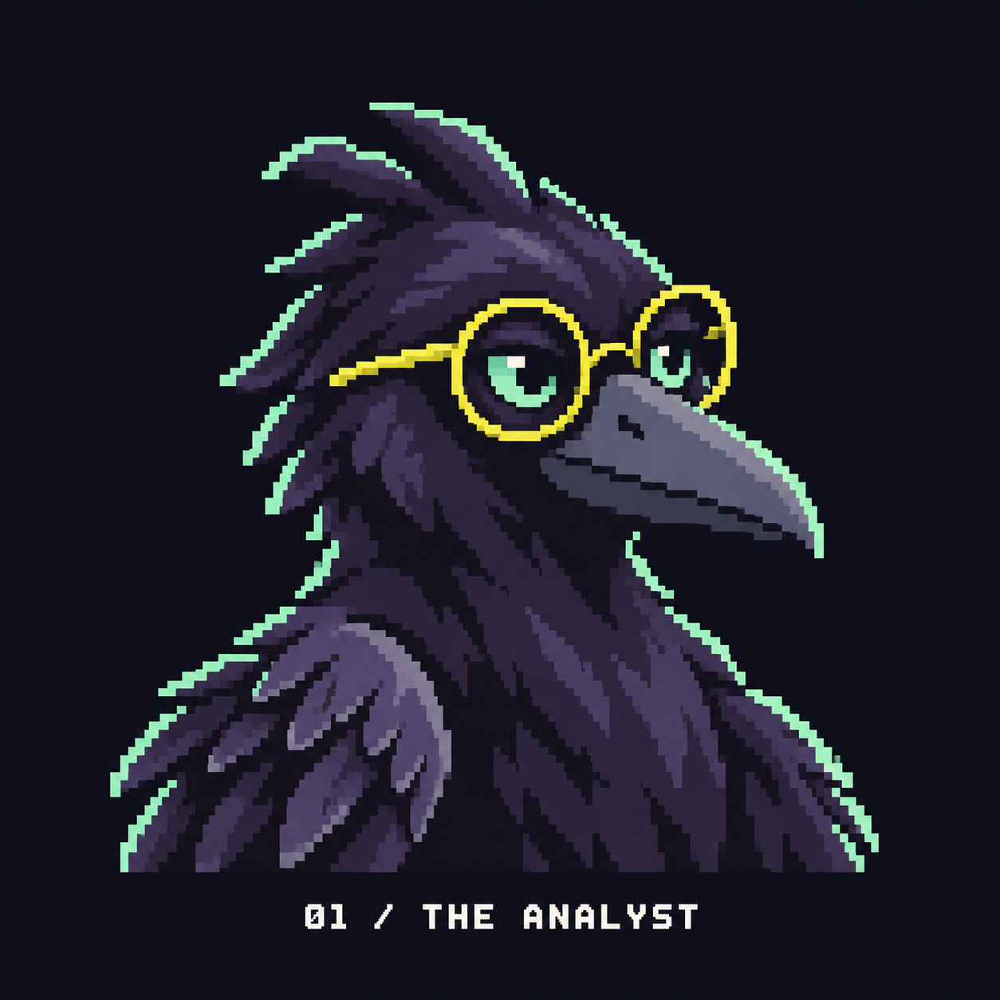
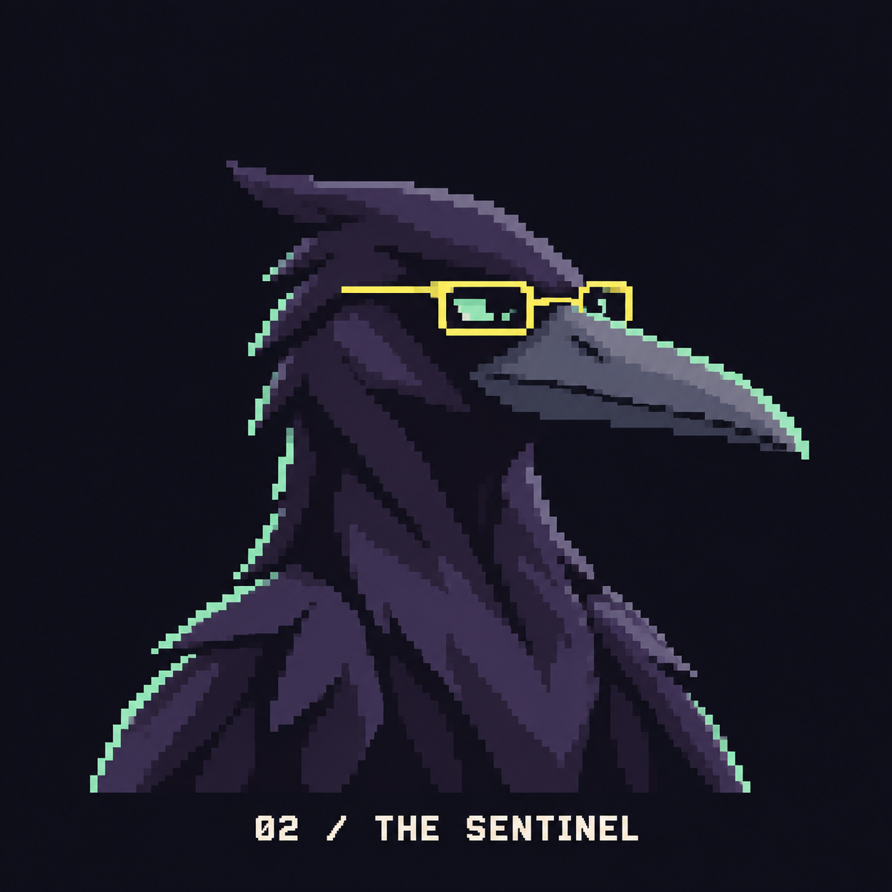
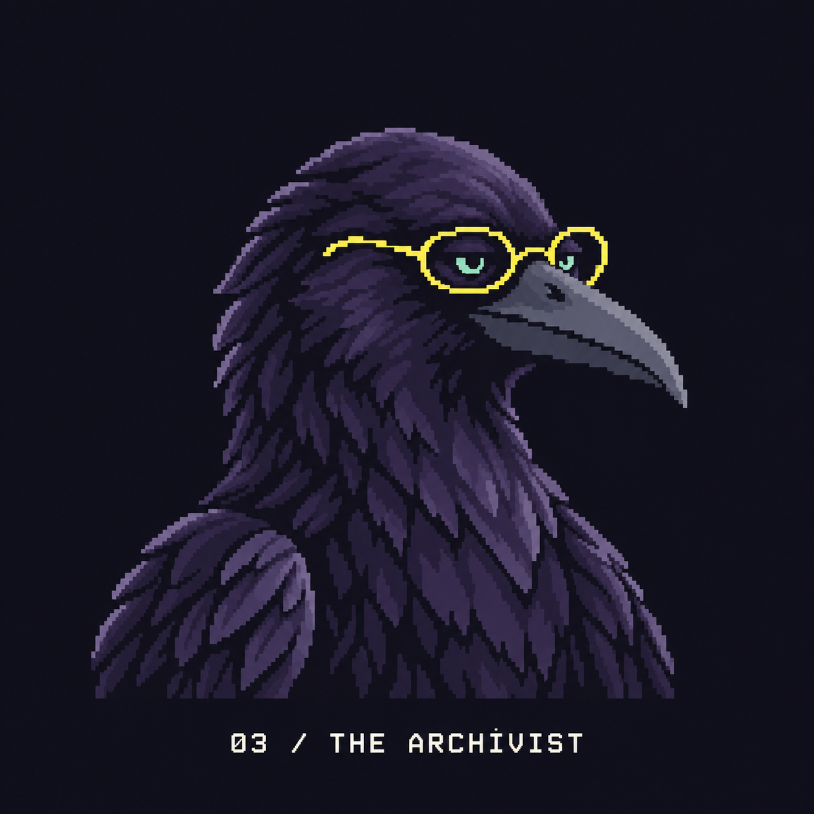
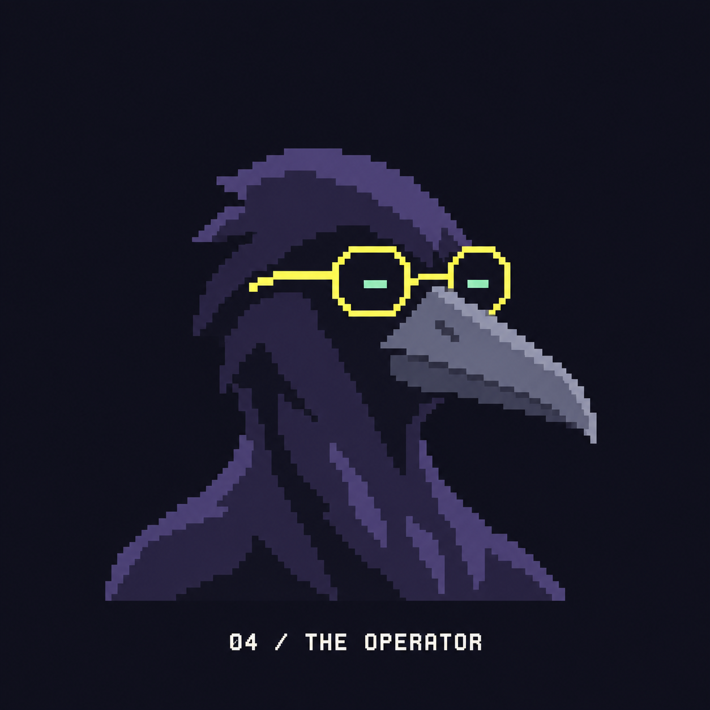

# Crowbo: four mature Scholar options

Created 2026-09-22 using the built-in image generation tool. The design keeps dark violet plumage, mint eyes and lemon glasses, while exploring more adult proportions and restrained expressions.

Historical selection: the user first chose the **Archivist with a mint edge along the outer feathers on the viewer's left** on 2026-09-22, preserved at [03-archivist-mint-rim-v2.png](03-archivist-mint-rim-v2.png). This was superseded by the refined Circuit Frames V3 later that day. See [the brand guide](../../../BRAND.md) for the current identity; the images below preserve the comparison.

## 01 / The Analyst

Closest to the original Scholar: fuller crest, round frames and an approachable expression.

## 02 / The Sentinel

Angular silhouette, smaller rectangular frames and a more assertive expression.

## 03 / The Archivist

Smooth crown, natural adult crow proportions, fine glasses and a quieter expression.

## 04 / The Operator

Simpler pixel clusters, restrained plumage detail and deadpan mint eyes.

[Generation prompts](prompts.md) and [the earlier mint-edge edit prompt](03-archivist-mint-rim-v2-prompt.md). Current previews use the later Circuit Frames V3 selection.
