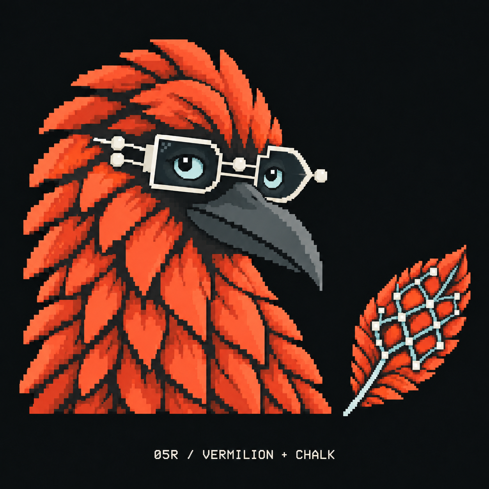

# Option 05 reversed

Created 24 September 2026 with the built-in image generation tool, editing [the original Chalk + Vermilion specimen](curious-05-chalk-vermilion-v1.png).

The user requested reversed colours. Vermilion now colours the crow's plumage and the Mesh feather; chalk colours the glasses and terminal nodes. The dark background, graphite beak, glacial eyes and Curious expression are retained. Visually inspected after generation. This is a review candidate.

## Exact prompt

Use case: precise-object-edit.
Edit the provided Crowbo option 05 specimen by reversing its two signature colours, chalk and vermilion. Preserve everything else as closely as possible.

Colour changes:
1. Replace the chalk/ivory plumage on both the Curious crow and the separate Mesh feather with the vivid vermilion red-orange used by the original glasses, target #FF593D. Use a few stepped darker red-orange/rust shades to preserve the existing pixel feather planes and depth.
2. Replace all vermilion glasses frames, bridge, temple arms and circuit terminal dots with chalk ivory, target #E7E5DB. Use the same chalk ivory for the little terminal nodes inside the separate Mesh feather.
3. Retain the graphite beak and dark feather creases, dark lenses, black pupils, pale glacial-blue eyes, muted blue-grey lattice lines inside the feather, and the original flat near-black background. Keep the bottom caption warm ivory.

Invariants: same Curious expression, identical eye sizes and pupils, head tilt, crest silhouette, long beak, shoulders, mature crow proportions, wearable AND/OR gate spectacles and round terminals. Same chunky crisp pixel clusters, same crow and feather positions and scale, same Mesh feather silhouette and topology. Do not redesign, add glow, gradients, blur, purple, lighting effects, new objects, or change the background. This is a colour swap, not a new character.
Replace only the caption wording with the exact small pixel-monospace text: "05R / VERMILION + CHALK". Keep its existing placement and style.

