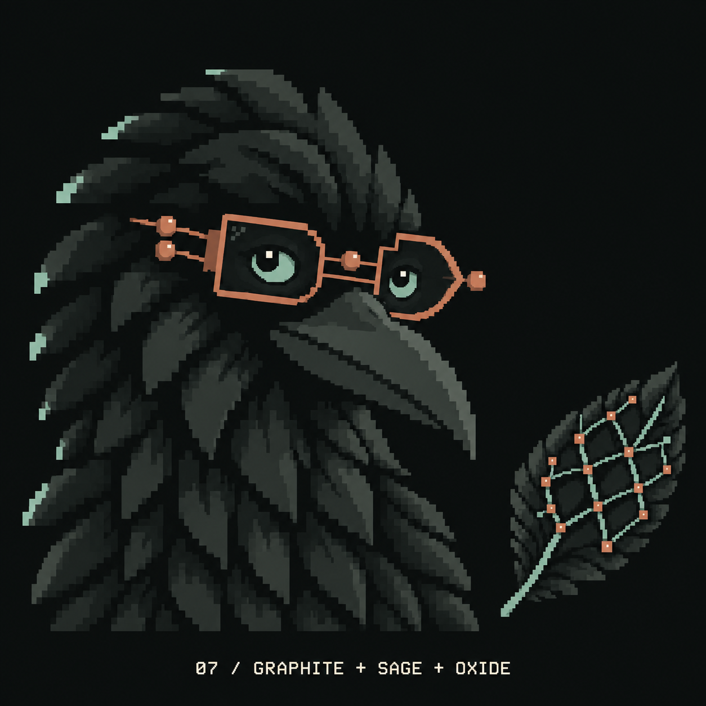

# Option 07: Graphite + Sage + Oxide

Created 24 September 2026 with the built-in image model, editing [the Graphite + Petrol specimen](curious-01-graphite-petrol-v1.png).

The user requested a preview of near-black plumage with two muted accents. This version uses neutral graphite feather planes, smoky sage eyes and occasional edge marks, and muted oxide circuit glasses. The separate Mesh feather follows the same palette. Visually inspected after generation; this remains a review candidate.

The hex values and approximate neutral-to-accent proportions below are prompt targets, not measurements of the generated raster. The website and brand master have not been changed.

## Exact prompt

Use case: precise-object-edit.
Asset type: Crowbo Curious crow palette specimen with a matching Mesh topology feather.
Edit the supplied specimen into the proposed GRAPHITE / SAGE / OXIDE direction. Retain its exact Curious crow expression, tilt, long beak, crest silhouette, mature proportions, eye sizes, chunky pixel-art construction, wearable circuit spectacles, pose and composition. Keep the smaller Mesh topology feather at the lower right.

Make the crow read almost black. About 85-90 percent of its visible form should be neutral graphite and charcoal: base #171B1A, deep shadow #0E1210, midtone #2B312E, and restrained highlights #414943. Use broad stepped feather planes with clear boundaries. Remove ALL purple, violet, blue and petrol/teal plumage. The beak must also be neutral graphite with a readable grey highlight, not blue or purple.
The ONLY two chromatic accents are:
- Smoky sage #91AA9D for expressive irises and a few tiny, separated outer feather-edge marks. Remove the reference's continuous bright mint outline. Use only about 4-6 short sage edge interruptions, leaving most of the outline charcoal.
- Muted oxide #C17D63 for the full functioning circuit glasses: rims, bridge, temple and small round terminal dots. Flat, muted reddish clay rather than yellow, bright orange, gold or shiny copper.
Keep pupils black with a single tiny warm-ivory catchlight. Dark lenses remain transparent-looking so the eye expression stays clear.

Matching feather: almost-black graphite planes with thin smoky-sage mesh/quill paths and small muted-oxide terminal nodes. Let the feather carry slightly more of the accents than the crow, but keep the feather body dark and its existing mesh shape intact.
Background: uniform neutral near-black #0C1010. Separate the dark silhouette through stepped charcoal values, not a glow or reduced opacity. Retain crisp square pixel edges, a limited palette, and the same scale and placement as the reference. No gradients, bloom, halos, shadows, framing boxes, props, added birds or circuitry outside the feather and glasses. No fine noisy feather texture or smooth illustration.
Replace the bottom caption with small warm-ivory pixel monospace text, exactly: "07 / GRAPHITE + SAGE + OXIDE".
This should feel calm, dark, intelligent and restrained. Do not brighten or saturate the muted accents to make them more dramatic.

