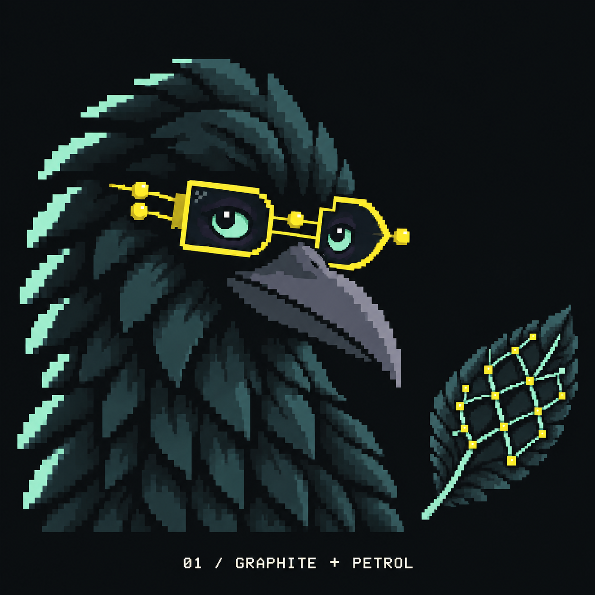
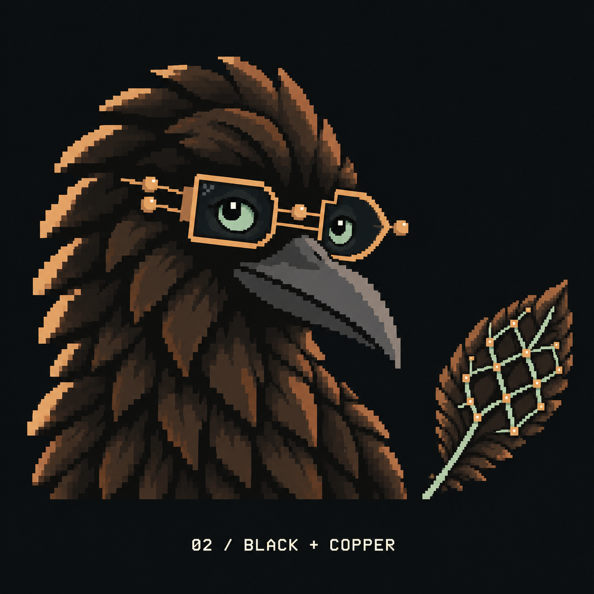
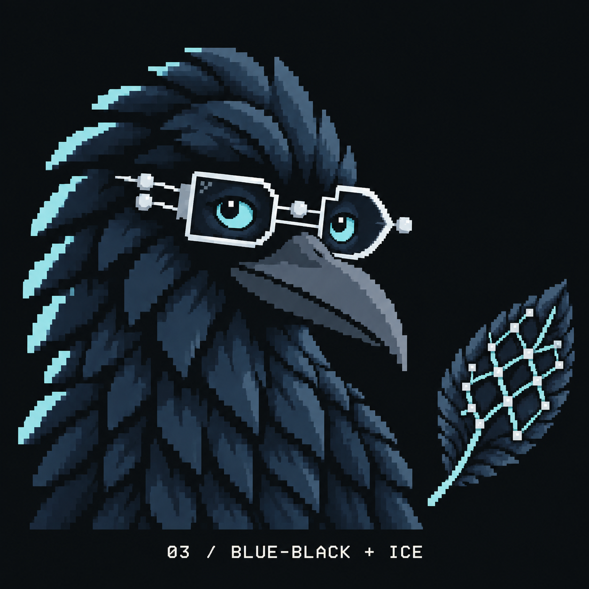
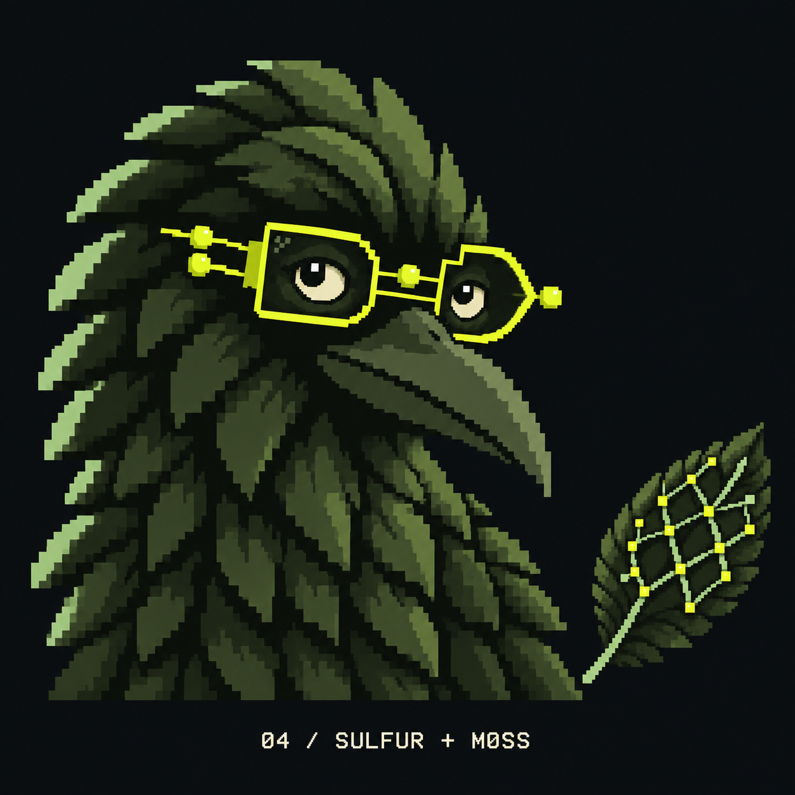
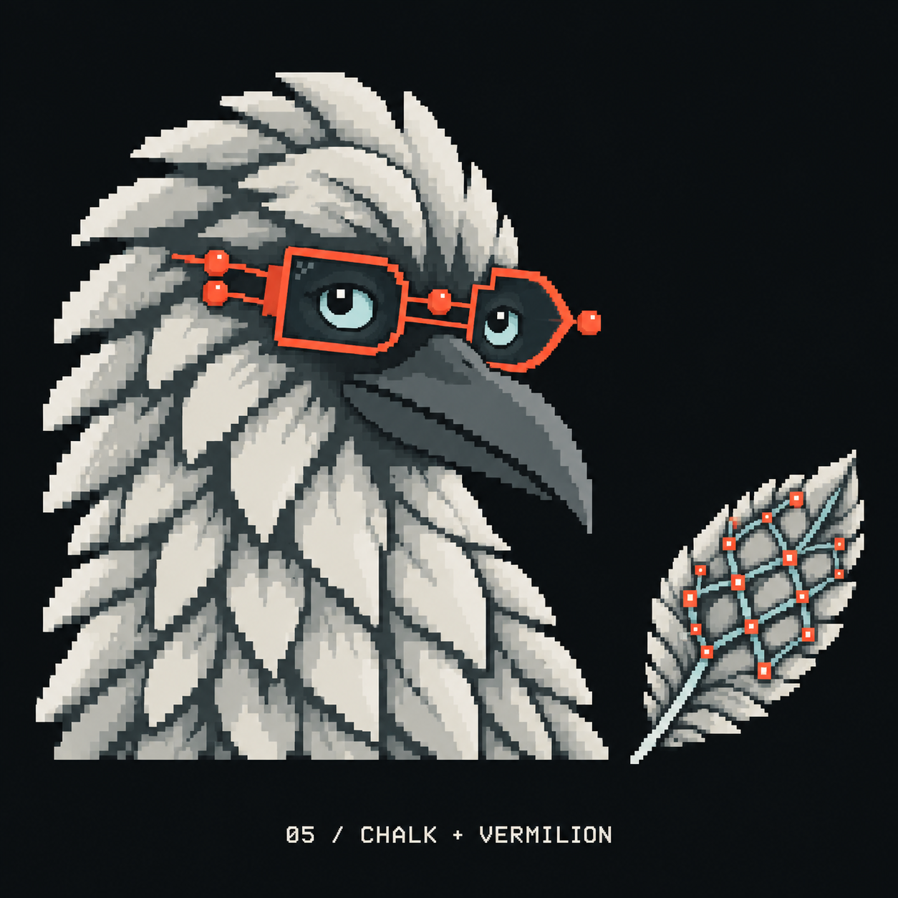
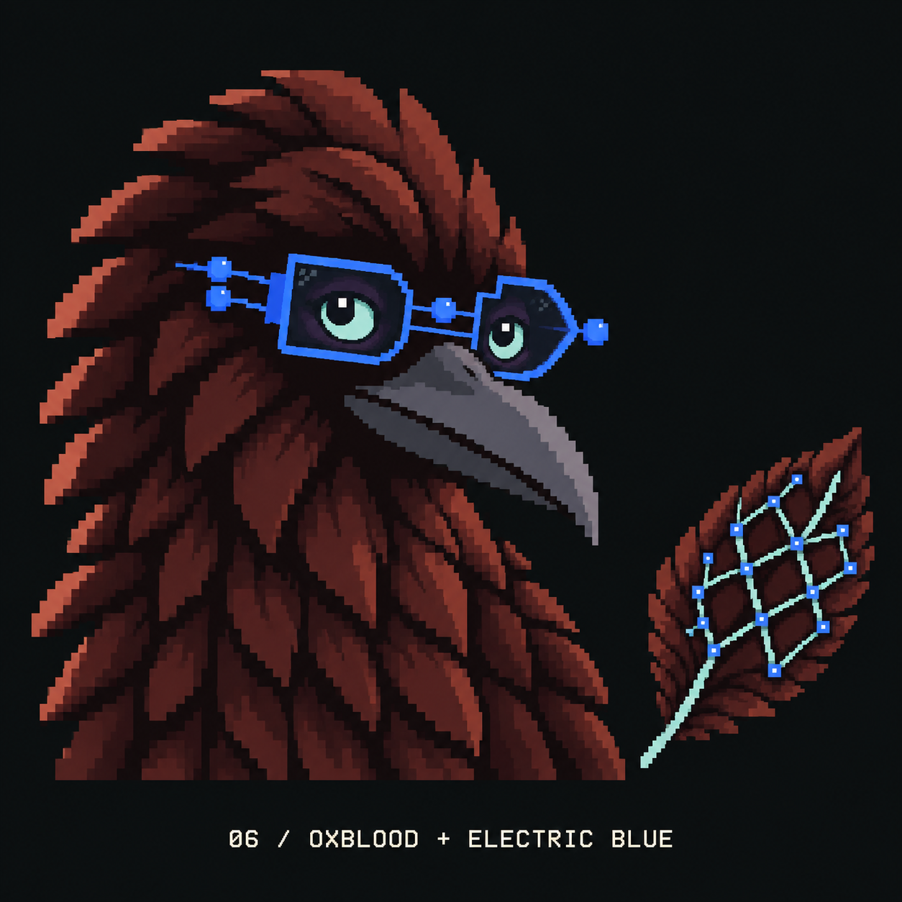

# Curious crow colour study

Created 24 September 2026 with the built-in image generation tool. Six exploratory palettes respond to the concern that the current Curious crow reads too purple and resembles Vanta's colour direction. These are review candidates; no website, deck or selected brand asset has been replaced.

Each specimen pairs the Curious expression with a matching Mesh topology feather. The pose and composition are closely matched generated interpretations, not pixel-identical recolours. Hex values below are prompt targets; the raster outputs contain additional shades.

## Comparison

| 01 Graphite + petrol | 02 Black + copper | 03 Blue-black + ice |
| --- | --- | --- |
|  |  |  |

| 04 Sulfur + moss | 05 Chalk + vermilion | 06 Oxblood + electric blue |
| --- | --- | --- |
|  |  |  |

The first three develop the proposed darker palettes. The final three explore a stronger departure. Chalk deliberately reverses the dark body into pale plumage. Every image was visually inspected for the Curious expression, circuit spectacles, matching Mesh feather and correct label.

## Sources

The user also requested [05 with chalk and vermilion reversed](05-reversed-prompt.md). This sibling version retains the original specimen for comparison.

- Character reference: [01 Curious in the expression sheet](../expressions-and-infrastructure/archivist-expressions-v1.png).
- Feather reference: [Mesh in the topology sheet](../pixel-topology/topology-feather-studies-v2.png).
- Current identity: [brand guide](../../../BRAND.md).

The two reference sheets are prior Crowbo-generated artwork. No Vanta artwork or external mascot was supplied to the image model.

## Exact prompt set

One built-in image generation call per option, using both source images. The full prompt for each call is the shared prompt below followed by that option's colour palette and exact label.

### Shared prompt

Use case: style-transfer.
Asset type: one square Crowbo palette comparison specimen, a polished raster pixel-art brand study.
Input image 1 is the character edit target: use ONLY the top-left crow labelled 01 / CURIOUS. Input image 2 is the feather edit target: use ONLY the top-right feather labelled MESH.
Primary request: make ONE recoloured version of this exact Curious crow, with ONE smaller matching mesh topology feather beside it. This is colour exploration, not a character redesign. Preserve the mature crow proportions, head tilt, expressive curious gaze, eye sizes, dark pupils, complete long beak, crest silhouette, chunky pixel feather clusters, and functioning wearable AND/OR circuit spectacles with bridge, receding temple, round terminal dots and dark lenses. Preserve the mesh feather's silhouette and lattice-shaped internal quill structure.
Composition: square 1536 by 1536 artboard if possible. Flat uniform neutral near-black #0C1012 background. Crow fills the left two-thirds, complete crest and beak visible, shoulders cropped naturally at their base, generous margins. One upright diagonal mesh feather sits separately in the lower right at about 42 percent of the crow's height, with clear space between them. Keep all six specimens at this identical composition and scale. Do not include any other crow, feather, title from the input sheets, card, border or diagram outside the feather.
Style: exact chunky terminal pixel-art language of the Curious reference, hard square edges, limited flat colour steps, clear stepped feather planes, crisp pupils and subtle expression. Dark graphite or stated base colours must dominate the body, with restrained highlights so the outline remains visible against the background. No violet, purple, lavender or magenta in any part of this specimen. No glow, bloom, gradients, blur, lighting halos, lens flares, drop shadows, smooth illustration, soft painterly shading, 3D metallic rendering, baby proportions, costumes or props. Change colours only; preserve recognisable identity and topology structure.
Text: one small warm-ivory pixel monospace label centred across the bottom, exactly the label supplied below. No other text.

### 01 / GRAPHITE + PETROL

Colour palette: Refined baseline. Crow body graphite #171E20 with deep shadow #0E1517, restrained muted petrol #355657 feather highlights and a few slate-teal #597A78 edge pixels. About 75% of the plumage stays in the two darkest steps. Retain lemon #EEF34B circuit glasses and mint #A4EDC3 eyes; use mint only for a very narrow intermittent left feather edge. Beak charcoal slate. Feather uses the same dark graphite and petrol, a thin mint lattice and sparse lemon terminal nodes. An almost-black crow, never a bright teal bird.

Text (verbatim): "01 / GRAPHITE + PETROL"

Output: [curious-01-graphite-petrol-v1.png](curious-01-graphite-petrol-v1.png)

### 02 / BLACK + COPPER

Colour palette: Warm industrial variation. Crow body warm black #181613 with shadow #100F0D, dark umber #352A23 feather planes, restrained oxidised copper #96633F highlights and sparse pale-copper #D2A171 edge pixels. At least 70% of plumage stays nearly black. Circuit glasses are warm copper #E0AF78, eyes are muted pale sage #B6CCB0. Beak warm graphite. Feather uses black-brown plates, a thin pale-sage lattice, and copper terminals. Subtle copper highlights, not an orange or brown cartoon bird.

Text (verbatim): "02 / BLACK + COPPER"

Output: [curious-02-black-copper-v1.png](curious-02-black-copper-v1.png)

### 03 / BLUE-BLACK + ICE

Colour palette: Cool restrained variation. Crow body blue-black #101923 with deep shadow #0C121A, slate navy #253747 feather planes, restrained steel-blue #4E7183 highlights. At least 75% of body remains dark. Glasses pale icy silver #D3E8E8, eyes clear ice cyan #9BDDE8. Very narrow broken icy-cyan left rim and graphite blue beak. Feather is blue-black with thin icy cyan lattice and pale silver terminals. Clean cold hardware mood, no saturated royal blue and no purple.

Text (verbatim): "03 / BLUE-BLACK + ICE"

Output: [curious-03-blueblack-ice-v1.png](curious-03-blueblack-ice-v1.png)

### 04 / SULFUR + MOSS

Colour palette: Wild option: organic terminal. Crow body blackened olive #1B2115, shadow #0D130A, broad but still dark moss #354629 feather planes with restrained lichen #70824B highlights. Circuit glasses sharp acid sulfur #D7FF3F. Eyes pale warm bone #F1EDCC with expressive black pupils. Sparse sulfur edge pixels, dark olive beak. Feather has black-moss plates, a thin muted lichen lattice and unmistakable acid-yellow terminal nodes. Distinctive moss-and-sulfur colour identity, disciplined flat pixels rather than neon glowing cyberpunk.

Text (verbatim): "04 / SULFUR + MOSS"

Output: [curious-04-sulfur-moss-v1.png](curious-04-sulfur-moss-v1.png)

### 05 / CHALK + VERMILION

Colour palette: Wild option: invert the crow into a pale mineral specimen. This is the deliberate exception to the dark-body rule. Plumage chalk ivory #E7E5DB, pale warm grey #B4BAB5 and deep graphite #394445 in feather creases. Keep the same adult crow head, long dark graphite beak, curious expression and exact silhouette, so this remains a crow rather than a dove or owl. Circuit glasses vivid vermilion #FF593D, eyes muted glacial blue #A7D4D6 with dark pupils. No lemon or mint glow. Feather is chalk and graphite with muted blue-grey lattice and sparse vermilion terminal nodes. Pale crow on the same near-black background, bold restrained editorial colour contrast.

Text (verbatim): "05 / CHALK + VERMILION"

Output: [curious-05-chalk-vermilion-v1.png](curious-05-chalk-vermilion-v1.png)

### 06 / OXBLOOD + ELECTRIC BLUE

Colour palette: Wild option: dark wine-red and electric blue. Crow body near-black oxblood #231112, shadow #140B0C, deep rust-red #542322 planes and restrained brick #85453B feather highlights. At least 70% of body stays dark. Circuit glasses electric periwinkle-free royal blue #397BFF, eyes pale ice #C1E5E5. Few brick-red left edge pixels, warm charcoal beak. Feather uses oxblood plates with a thin muted ice lattice and electric-blue terminals. No purple, violet, magenta or pink; the plumage must read dark red-brown while the frame reads clean blue. Adult and mysterious, not a colourful superhero bird.

Text (verbatim): "06 / OXBLOOD + ELECTRIC BLUE"

Output: [curious-06-oxblood-electric-blue-v1.png](curious-06-oxblood-electric-blue-v1.png)
