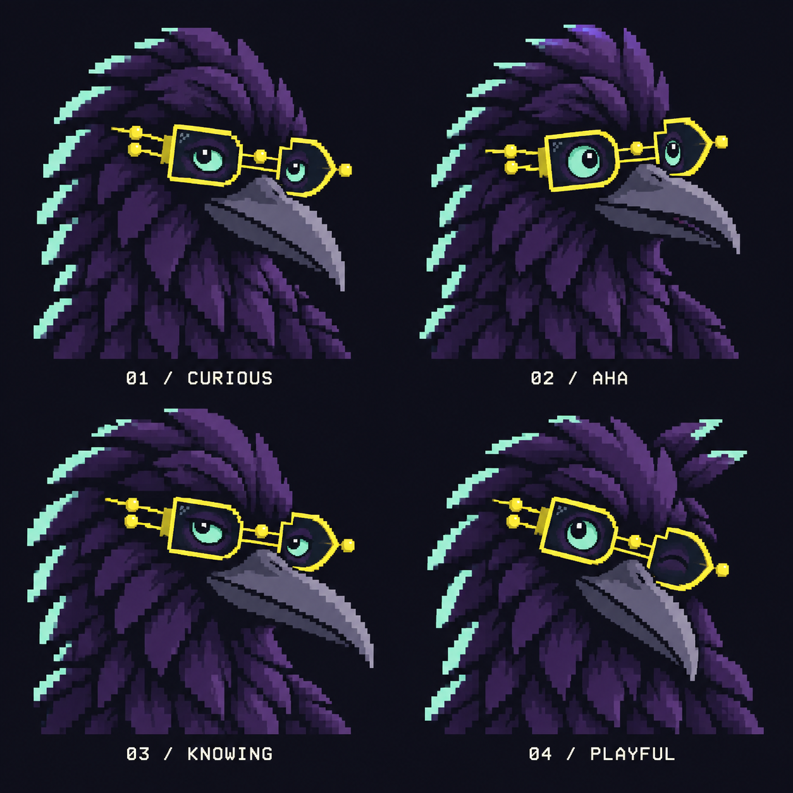
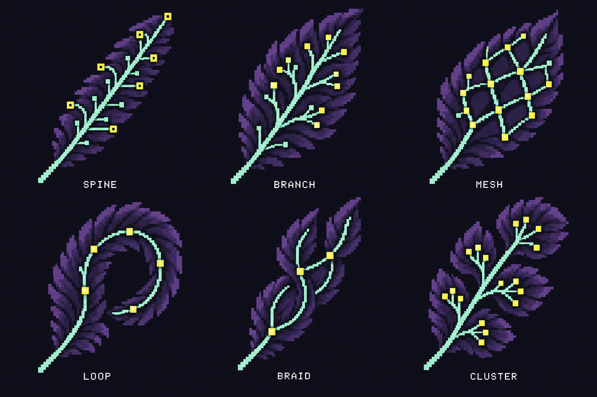
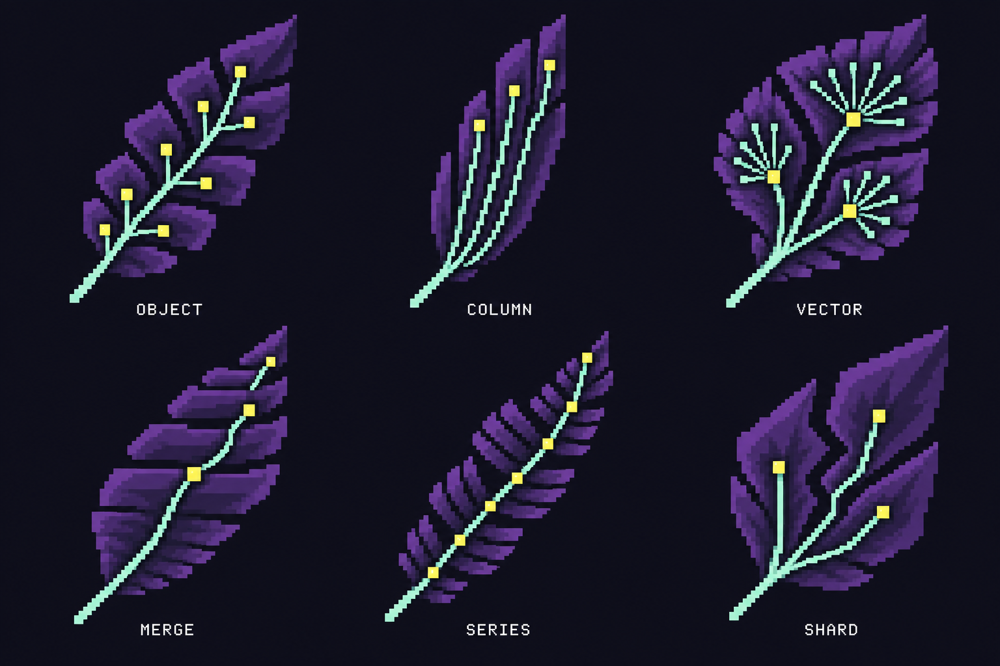

# Archivist expressions and infrastructure feathers

Created 24 September 2026 with the built-in image generation tool. This extends the [first pixel study](../pixel-topology/README.md) with four expressions and six more feather concepts. These are review candidates.

## Four Archivist expressions

1. Curious: head tilt, more direct gaze and lifted brow.
2. Aha: open eyes and a slightly parted beak.
3. Knowing: asymmetric eyelids and a quieter expression.
4. Playful: a wink and raised crest feathers.

The proposed everyday expression is Curious. Aha and Playful could become occasional animation poses. This is a design recommendation, not a selected production update.

## Twelve feather types

The first six:

The new six:

| ID | Name | Visual structure |
| --- | --- | --- |
| 01 | Spine | Barbs along one common path. |
| 02 | Branch | Forking barbs that form a tree. |
| 03 | Mesh | Connected lattice across a broad vane. |
| 04 | Loop | Curved plume around a returning path. |
| 05 | Braid | Interleaved paths that separate and reunite. |
| 06 | Cluster | Groups of barbs attached to a shared quill. |
| 07 | Object | Separate compact feather plates attached individually to the quill. |
| 08 | Column | Long parallel ribs with narrow gaps. |
| 09 | Vector | Several groups of small marks around distinct centres. |
| 10 | Merge | Overlapping tiers of progressively broader barbs. |
| 11 | Series | Repeated segments along a timeline-like quill. |
| 12 | Shard | Distinct angular sections linked at one quill junction. |

The infrastructure mappings are visual interpretations. They do not specify Crowbo's technology choices, evidence classes or weights. They combine storage models, index structures and partitioning concepts rather than claiming to be twelve mutually exclusive database types.

## Research references

Reviewed public documentation on 24 September 2026. The concepts informed the prompts; no vendor images or logos were copied.

- [Turbopuffer architecture](https://turbopuffer.com/docs/architecture) and [concepts](https://turbopuffer.com/docs/concepts) describe durable object storage, centroid-based vector search and sorted runs merged within an LSM tree. These informed Object, Vector and Merge.
- [ClickHouse introduction](https://clickhouse.com/docs/get-started/about/intro) describes storing column values together. This informed Column's parallel ribs.
- [Timescale hypertables](https://docs.timescale.com/use-timescale/latest/hypertables/) describes chunks holding particular time ranges. This informed Series.
- [MongoDB sharding](https://www.mongodb.com/docs/manual/sharding/) describes distributing subsets of data across machines. This informed Shard's separated sections.

## Generation and review

Mode: built-in image generation, using the two existing Crowbo concept boards as local visual references. Both new boards were inspected for the four expressions, six distinct new feather forms, readable labels and consistency with the purple, mint and lemon palette.

The PNG files are concept sheets. Logical pixel dimensions in the prompts are style targets, not a measured production grid. Selection, separate sprite exports, small-size legibility and animation remain later design steps.

## Final prompt set

### Four Archivists

Use case: style-transfer
Asset type: Crowbo Archivist expression design study, a 2 by 2 comparison board.
Primary request: Make FOUR clearly distinct, more engaging and slightly more fun versions of the approved chunky Terminal Archivist. Push the terminal pixel character a little further. Retain mature crow identity, purple plumage, mint eyes and yellow wearable circuit glasses.
Input image 1 is the identity/style reference, specifically the LEFT crow labelled TERMINAL ARCHIVIST. Do not use the more finely detailed right crow as the target. Input image 2 is a supporting palette and pixel-style reference for the matching feather family.
Scene/backdrop: perfectly flat midnight #10101B, no gradients, glow or shadows. Square board, approximately 1536 by 1536, four equal generously spaced quadrants with no dividing lines or cards. Each portrait is a complete uncropped crow head and short shoulder bust, at the same scale, with a small ivory pixel-monospace label below. No other text or objects.
Style: deliberately hand-clustered sprite art, approximately 56-64 logical pixels high for each complete portrait, enlarged with crisp square nearest-neighbour edges. Chunkier than the LEFT reference, yet enough detail in eyes and the circuit glasses to read personality. Consistent pixel grid throughout. About 8-10 flat shades. Broad purple feather planes and blocky stepped edges; no fuzzy feather texture. Emphasise the face in every quadrant, crop no beak or feather crest.
Shared identity: same mature crow proportions and long pointed purple-grey beak. Keep expressive mint eyes, with dark readable pupils and one tiny square ivory highlight per eye. Open the upper lids, reduce the drooping sleepy brow, lift the cheek plumage slightly. Subtle brighter purple face planes around the eyes. Eyes around 15% larger than reference, still intelligent and credible, never anime or plush. Mint pigment on only a few left outer feather tips, no light-emitting glow.
Glasses: retain the lemon #EEF34B functional spectacle frame, D-shaped left AND-gate lens, pointed OR-gate right lens, real side arms and a bridge, sparse little terminal nodes on the arms and bridge. Glasses follow the head angle and fit the face. No circuits printed on the crow's face.
Four genuinely different expressions, not duplicate poses:
Top left, label "01 / CURIOUS": three-quarter right-facing head tilted about 10 degrees towards the viewer, one feather brow raised, both mint eyes open, pupils looking back towards the viewer. Inquisitive and friendly, beak closed. The strong everyday mascot candidate.
Top right, label "02 / AHA": slightly forward posture, bright alert eyes widened in discovery, raised crown tuft, beak parted by just one dark pixel as though it noticed a useful connection. Intelligent delight without a cartoon grin.
Bottom left, label "03 / KNOWING": three-quarter face slightly more towards the viewer, one brow raised while the other eye has a relaxed but awake lid. A subtle amused, self-assured expression. The longest clear beak silhouette of the four. Closed beak, no human mouth.
Bottom right, label "04 / PLAYFUL": head gently cocked to the other side, one eye in a friendly near-wink and the other open with a lively pupil looking at the viewer. Two small crest feathers lift asymmetrically. Mild mischief, not goofy, still a capable Archivist.
Palette: #10101B background, #28243E purple body with a few muted purple highlight steps, #A4EDC3 mint eyes and limited feather-edge pixels, #EEF34B lemon glasses, #F3E9D5 label/highlights.
Constraints: keep this as four expressions of the SAME recognisable character. Do not add outfits, props, hats, textural noise, binary wallpaper, letters on the body, huge round baby heads, angry brows, oversize glossy eyes, teeth, tongues, human smiles, 3D bevels, soft smoothing, halos or gradients. The fun comes from the eyes, tilt and pose.

### Six additional feathers

Use case: stylized-concept
Asset type: Crowbo six new infrastructure-feather concepts, extending an existing six-type family to twelve.
Primary request: Create SIX NEW distinctive pixel feather designs inspired by actual database and storage structures. Keep the excellent established feather family in input image 1, but push the new set slightly chunkier and more terminal-like, with broad hard pixel clusters. Do not redraw its six old shapes. Input image 1 is STYLE REFERENCE ONLY.
Composition: a landscape 3 by 2 comparison sheet, approximately 1536 by 1024. Six fully visible isolated feathers, no boxes, dividers or surrounding objects. Most feathers rise diagonally up/right from a clear exposed quill. Equal visual prominence, substantial empty spacing and margins. Labels small warm ivory pixel monospace, centred underneath each, exactly as specified below.
Pixel style: approximately 52 by 72 logical pixels per feather, nearest-neighbour enlargement with visible consistent square steps, slightly coarser than the reference. Flat muted purple planes with 2-3 shade steps, mint embedded circuit paths and a few square lemon terminals. The infrastructure should determine the anatomy and silhouette. Build feathers from these forms, not a database icon stamped onto a conventional feather.
07 / OBJECT: object storage. A broad angular plume built from 7-9 separate compact rectangular feather plates like independently addressed objects. Dark gaps between groups; small lemon terminal pixels at a few plate roots, linked individually to a narrow mint quill. Layered shingle-like barb construction still tapers into a pointed feather. No bucket or cloud pictogram.
08 / COLUMN: columnar storage. A tall narrow fluted feather composed of four long parallel purple ribs of unequal lengths, gathered into the quill, with thin dark slots between them. Mint traces run lengthwise and very few lemon cells terminate near their tips. The silhouette is recognisably tall and reed-like, unlike the broad OBJECT feather.
09 / VECTOR: centroid-based vector index. A fan-shaped feather of three broad angular sectors. Within each sector several tiny purple/mint barb marks gather around ONE small lemon centroid; only these three centres connect to the quill by clean mint paths. Small meaningful spaces separate sectors. Sweeping radial vane construction with a broad top, slender base. Not a dense random graph, crosshair or mathematical plot.
10 / MERGE: log-structured merge storage. A strongly asymmetric stepped feather with three overlapping levels of barbs, short separate runs near the pointed upper tip merging into two larger bands and then one broad lower vane near the shaft. Two short mint routes join into one at a small lemon point. Flat terraced layers shape the feather, not a stack of server cylinders. Clearly different from recursive tree branching.
11 / SERIES: time-series chunks. A long gently curved feather whose quill is a segmented mint timeline, with evenly spaced small nodes. Compact paired purple barbs alternate along it, grouped into four dark-separated time sections with different barb lengths, like a restrained rhythm. One lemon terminal marks the newest tip. Curved stepped silhouette, not a straight comb, waveform graphic or clock.
12 / SHARD: horizontal data partitioning. A wide diamond-like plume split into three disjoint angular lobes by thin zigzag negative-space seams. Each lobe has its own small path and one lemon root; the three paths fan from one quill junction. The purple sectors fit together into one feather yet their separate boundaries are unmistakable. Not the clustered round tree form in the original sheet.
Palette and mood: solid perfectly uniform #10101B midnight background, #28243E and two or three muted purple highlights occupy most of the feathers, narrow #A4EDC3 mint routes, sparse #EEF34B lemon nodes, #F3E9D5 labels. No atmosphere or lighting effects. Muted, sophisticated, playful infrastructure craft, clearly the same family as the reference.
Avoid: glow, halos, shadows, gradients, smoothing, realistic tiny hair texture, a repeated identical leaf silhouette, sci-fi PCB clutter, neon, photographic objects, literal vendor logos, copied vendor diagrams, database cylinders, clouds, buckets, cards, six existing reference feathers. Each design is a visual metaphor inspired by infrastructure, not a literal system diagram.

