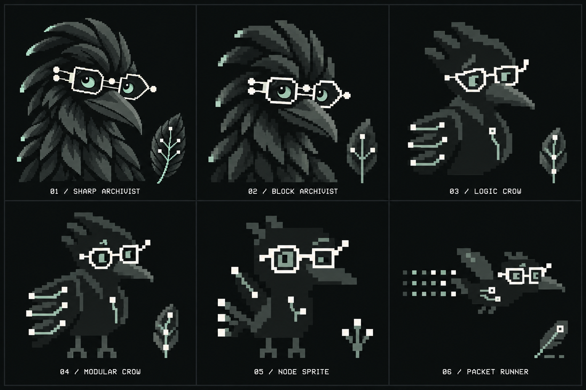

# Crowbo: six pixel tiers

24 September 2026. Character studies generated with the built-in image model. Subsequent selection and palette status are recorded in [the brand guide](../../../BRAND.md).

The user requested a brighter replacement for oxide and six increasingly pixelised character designs, extending into a playful early-game sprite style. Chalk white is the dominant accent across the set; muted sage supports the eyes and infrastructure marks. The colour targets are near-black plumage `#171B1A`, charcoal `#38413C`, sage `#91AA9D` and chalk white `#F5F3E8`.

## Comparison for review

| Tier | Design exploration | Infrastructure motif |
| --- | --- | --- |
| [01 Sharp Archivist](studies/01-sharp-archivist-v1.png) | Closest to the Curious Archivist; detailed portrait with bright white spectacles. | Branching tree |
| [02 Block Archivist](studies/02-block-archivist-v1.png) | Broader feather blocks, larger eyes and thicker frames. | Mesh target; generated specimen simplifies the paths |
| [03 Logic Crow](studies/03-logic-crow-v2.png) | A geometric half-body character whose wing branches into connection points. | Split and merge |
| [04 Modular Crow](studies/04-modular-crow-v2.png) | A compact, perched full-body character with modular wing feathers. | Stacked segments in source; board interprets them as connected branches |
| [05 Node Sprite](studies/05-node-sprite-v2.png) | A squat game sprite with a branching tail and a lifted wing. | Hub |
| [06 Packet Runner](studies/06-packet-runner-v2.png) | A flying sprite with segmented data-packet trails. | Parallel bus |

The board is the clean comparison preview. It was generated from five specimen references, with tier 02 interpreted as an intermediate between 01 and 03. It is not a pixel-identical collage. The separate studies retain their original generated files; studies 03-06 have rough alpha edges and text that were cleaned in the board.

The target pixel heights in the prompts communicate increasing simplification. These are high-resolution concept images, not measured native-grid sprite assets. Palette values are also prompt targets rather than sampled guarantees. The paths suggest infrastructure patterns; they are not implementation diagrams.

## Review notes

All six board positions, labels, dark plumage, white eyewear and sage secondary accents were inspected visually. The sheet shows a substantial change in proportions and detail between the portrait and game-sprite ends.

The first reference-based pass kept tiers 03-06 too close to the detailed Archivist. Those four were redrawn without a raster reference, then the six-tier comparison was generated with edge cleanup. [Exact prompts and input provenance](PROMPTS.md) record the chosen studies and final board.

The user subsequently selected a character from this board. [The brand guide](../../../BRAND.md) owns that decision and the palette status. A [warmer oxide accent specimen](../modular-crow/README.md) explores the follow-up. The website and deck remain unchanged by these studies.
