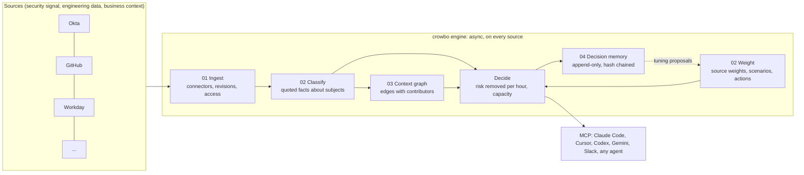

# The Crowbo engine

This is the target architecture for the decision engine and the brief for the engineers who will build it. A working micro-prototype lives in [`backend/src/engine/`](../backend/src/engine/). It runs end to end on a fictional company and serves the result over MCP. It shows the shape and the contracts. It is not the production code. [ADR 0002](adr/0002-deterministic-risk-arithmetic-decides.md) records the decision that shapes everything below.

## What it answers

*What should this security team do next, given the risk it actually carries and the time and money it actually has?*

The answer is a short list of next moves. Each move is one of four kinds: fix, fund, build or drop. A drop stops work that does not move the risk, and gives that time back. Each move states:
- the risk it removes, as a range a year;
- its cost in hours and cash;
- its owner and due date;
- the cited evidence behind it.

Moves that did not make the list are deferred, each with its reason. Every answer, call and weight change is kept.

## Architecture

| Layer | Owns | Prototype module |
| --- | --- | --- |
| 01 Ingest | Reading each tool on its own schedule. Every item is an immutable revision with its readers. | `ingest.ts` |
| 02 Classify | Turning readable text into typed facts about subjects. Every fact quotes its source exactly. | `extract.ts` |
| 02 Weight | The company's visible, editable inputs: source weights, risk scenarios with frequency and loss ranges, and candidate actions with effort ranges. | `model.ts`, `fixture.ts` |
| 03 Context graph | The relationships no single tool holds: owners, teams, launches, controls and systems. Each edge records the source revisions it came from. | `graph.ts` |
| Decide | The next moves by risk removed, under capacity. Deterministic. | `decide.ts` |
| 04 Decision memory | Every decision, call, exception, weight change and tuning proposal, in order, tamper-evident. | `memory.ts` |
| Surface | The engine over MCP for any harness. | `tools.ts`, `scripts/mcp-local.ts` |
| Wiring | One refresh runs the layers in order and precomputes the decision, so asking is a lookup. | `engine.ts` |

## Who does what

The decision is arithmetic over evidence and the company's own stated inputs. Models help at the edges.

| Step | Done by | Why |
| --- | --- | --- |
| Read sources, apply access | Code | Restricted content must never reach anything derived. |
| Extract facts from prose | A model, qualified on reviewed cases ([evaluation contract](EVALUATION.md)) | Models read prose well. Each fact is checked against an exact quote. |
| Set weights, scenarios, estimates | People, with model proposals labelled as proposals | The company owns its risk appetite and must be able to see and change it. |
| Compute risk removed and choose moves | Code | The same inputs must give the same answer, and every number must trace back. |
| Explain, answer follow-ups | A model, citing the computed result | Explanation must not become selection. |
| Accept, override, grant an exception | A person | Recommendations grant no authority. |

## The decision, in arithmetic

The prototype uses deliberately simple arithmetic. [Production](#what-engineers-build) replaces each step with something stronger.

1. **Expected annual loss** for each scenario = frequency × loss per event, both as ranges with a stated basis.
2. **Evidence.** A scenario's gap is *evidenced* when a fact from a source weighted at least 2 out of 5 meets its condition. It is *not observed* when such facts exist but none meets it. It is *unresolved* when no usable fact exists, or the usable facts conflict.
3. **Confidence** = the strongest supporting source weight ÷ 5. It is shown on every move.
4. **Risk removed by an action** = expected loss × reduction fraction × confidence, summed over the scenarios the action touches.
   - It counts only where a gap is evidenced.
   - Risk an action *adds* (a drop) counts in full, whatever the evidence.
5. **Choosing.**
   - Drops come first, provided the risk they add stays within the company's tolerance and their prerequisites hold (for example "found no issues in four quarters" and "superseded by"). They give hours back to the horizon.
   - The rest are taken in order of risk removed per hour, as long as they fit at their upper effort bounds.
   - Anything else is deferred with the exact shortfall.
6. **Owner and due date** come from the graph. The owner is the control's owner. The due date is the earliest launch that depends on the control, or else the end of the horizon.

A decision's ID is the hash of its inputs: facts, weights, scenarios, actions, capacity, viewer and method version. New evidence or a weight change produces a new decision, and the change is recorded in memory.

## Invariants

Each one is tested in [`test/engine/engine.test.ts`](../backend/test/engine/engine.test.ts) and must hold in production.

1. **Access before derivation.** Records the viewer may not read are dropped before extraction, so no fact, edge or decision carries them. Derived records in production inherit the narrowest audience of their contributors.
2. **Quoted facts only.** A fact whose quote is not in the exact source text is rejected, whoever produced it.
3. **Text is data.** Instructions inside source text change nothing.
4. **Determinism.** The same inputs give the same decision ID.
5. **Visible inputs.** Weights, scenarios, estimates and capacity are data the company can read and edit. A change is logged with who made it and why, then the decision is recomputed.
6. **Freshness by construction.** Decisions are addressed by their inputs, so new evidence makes the previous decision stale.
7. **Memory is append-only and tamper-evident.** The hash chain fails if any entry is edited, removed or reordered.
8. **Tuning is proposed, never applied.** A pattern of calls (two disputes of one source) produces a proposal. Only a person's weight change applies it.
9. **No authority.** Every answer is a recommendation, and nothing executes.

## Try the prototype

The repo's `.mcp.json` starts the local server in Claude Code. In a new session in this folder, approve the `crowbo` server, then ask:

- "What are Northwind's next moves, and why?"
- "Explain why deploy approval was deferred."
- "Simulate the Okta cleanup. What changed?"
- "Slack threads aren't proof for us. Set Slack's weight to 1. What happens?"
- "Show me decision memory."

**What is a stand-in:**
- The company and all its numbers are invented.
- Connectors read a fixture.
- The model extractor returns pre-written labels. One of them is a deliberate hallucination, which binding rejects.
- State lives in one process.

## What engineers build

| Area | Production shape | Reuse from `backend/` |
| --- | --- | --- |
| Storage | One SQLite Durable Object per tenant in the EU (ADR 0001). Tables: revisions, facts, weights, scenarios, actions, edges (with contributor revisions), decisions (input-addressed) and memory (append-only, hash chained). | `storage/sql-store.ts`, `services/evidence.ts` (revisions, heads, grants) |
| 01 Ingest | Connectors per tool, each with its own sync cursor and schedule, via Durable Object alarms or Queues. Start with two or three per column, chosen with design partners. | `services/sync.ts`, `providers/slack.ts` |
| 02 Classify | A model extractor that fills the predicates each scenario and action reads, for each registered subject. Qualified by `eval/score.ts`, which needs a recall threshold and an absolute misbinding ceiling added. | `domain/facts.ts` (quote binding), `standing/model.ts`, `eval/score.ts` |
| 02 Weight | Editable weights, scenarios and estimates, with provenance on every number (observation, expert, reference data or model proposal). | `domain/decision-request.ts` (risk estimate shape) |
| 03 Graph | An edges table with recursive queries in the tenant database. Traversal checks every contributor's current access. No graph database until a measured multi-hop failure justifies one. | — |
| Decide | Replace the greedy fit with portfolio optimisation over intervals: interval dominance or Monte Carlo over the ranges, and exact selection under capacity (actions are few). Report sensitivity: which estimate would flip a move. | `programme/engine.ts` (bounded enumeration, owner choice, reassessment) |
| 04 Memory | Append-only table, hash chained, exportable for audit. Calls feed tuning proposals and the evaluation set. | `standing/` (immutable versions, predecessor chain), `services/feedback.ts` |
| Async refresh | Recompute on each sync and weight change, never on request. Serving is a lookup, about 56 ms p50 on staging today. | `standing/service.ts` |
| Surfaces | MCP with OAuth for Claude and every harness. A Slack app as a place to ask, not just a source. | `app/mcp.ts`, `app/oauth.ts` |
| Search | Turbopuffer finds candidate sources for extraction. It never chooses the decision population. | `providers/turbopuffer.ts` |

**Build order:**
1. Storage and the decision contract (weights, scenarios, actions, decide) on hand-entered facts.
2. Decision memory.
3. The model extractor behind the evaluation gate.
4. Edges.
5. Connectors.

Each step is usable on its own, and each one is verified against reviewed cases before the next starts.

## Open questions

- **Weight semantics.** The prototype weights *sources*, meaning how much the company trusts each signal. Risk estimates sit on *scenarios*. Is that split right for buyers, and who sets the first values?
- **Where estimates come from.** Frequency and loss ranges need a defensible basis: incident history, reference data, expert elicitation or model proposals. Which is first, and how is each labelled?
- **Embedding residency.** Voyage runs in an unspecified global location. Resolve this before indexing any real tenant data (ADR 0001).
- **The evaluation set.** About 30 two-reviewer cases per question kind gate production. This is the critical path whatever else is built.
