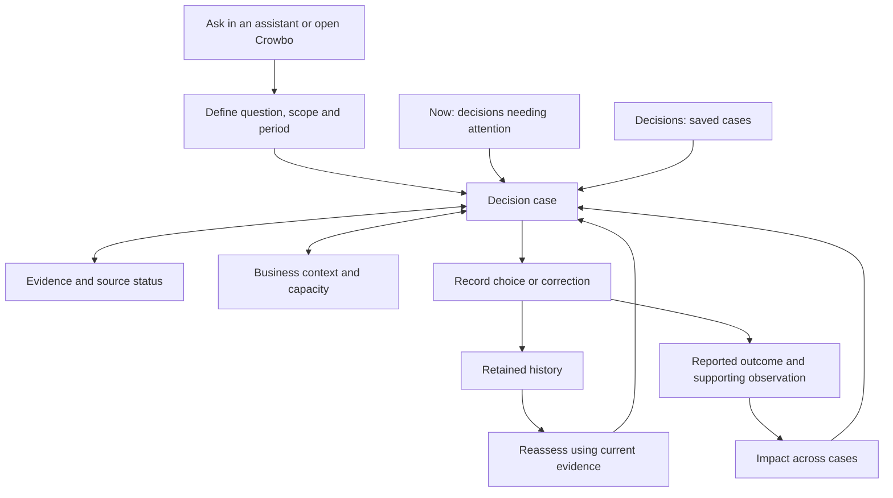

# Crowbo interaction model

Ownership note, 29 September 2026: this document owns the frontend interaction plan. The backend contracts are now in this repository. The public Decision Studio still uses local synthetic state and has no backend connection.

28 September 2026, with the simplicity direction updated on 29 September. Page and workflow exploration grounded in the connected backend, deck v35 and public interaction research. The current product UI uses plain navigation labels as described in [Crowbo vocabulary](#crowbo-vocabulary); the earlier bird vocabulary is retained there as design history. A private static decision prototype now renders saved backend results; no multiuser UI or customer usability study exists. The [foundation](FOUNDATION.md) owns product intent; the [backend brief](TECHNICAL-PLAN.md) owns implementation sequencing; [evaluation](EVALUATION.md) owns judgment quality.

## Initial workflow portfolio, 29 September

The [foundation](FOUNDATION.md#initial-workflows) selects **remediation tracking, access reviews, and issues and exceptions management** as applications of Crowbo's security decision capability. This selects the portfolio, not launch order, equal implementation depth or the commercial entry point. The [backend workflow mapping in draft PR #10](https://github.com/GRC-Engineer/crowbo/blob/c6e57be37b72900a6c28e6f82f363a122f231c15/docs/TECHNICAL-PLAN.md#security-workflow-mapping-for-decision-studio-29-september-2026) supplies the candidate case basis for this plan. That mapping is proposed development material, not implemented contract extensions or a qualified answer key.

The earlier public walkthrough had `access` and `upgrade` cases. The implemented frontend now has `remediation`, `access` and `exceptions`, with access scoped to one fictional account. The shared source specifications and verification receipts are in the [Decision Studio README](../design/decision-studio/README.md#three-security-workflows-and-deeper-sources-29-september). These are authored UI examples; no backend inference or contract extension is represented as running.

| Prepared choice | Proposed opening question | UI change and proof to make visible |
| --- | --- | --- |
| Remediation tracking | The gateway security fix is merged. What should happen next, and can we close the finding? | Replace the general upgrade story with a named fictional authentication finding, affected service/version and agreed treatment. Separate merged, deployed, verified and proposed closure. Retain launch timing and the prior regression where they affect feasible rollout or interim treatment. |
| Access reviews | Can we remove this support account's standing administrator access without breaking its approved work? | Scope the question, sources, result, history and Assistant preview to one selected fictional account and system. Preserve the annual-recovery challenge and tested, unverified and unavailable alternatives. Do not infer that one account's result applies to 12 staff. |
| Issues and exceptions management | A production service is missing required admin audit logs. Should we remediate now or request a time-limited exception? | Add a named logging requirement, observed gap, existing issue and supported response options. Distinguish an exception request, approval evidence, safeguard verification and validity. A saved request grants no approval. |

Issues and exceptions establish the meaning and handling of a problem. Remediation follows the chosen treatment toward verified completion. Keep stable case references and link issue, treatment and exception records where they concern the same problem. A deviation, requested exception, authorised acceptance and implemented safeguard have different states. Changed facts or expiry prompt explicit reassessment; the preview must not imply automatic monitoring. One access case crossing these workflows demonstrates continuity, not transfer to independent domains.

Retain business context when it changes the security choice. A reporting need, customer launch, previous regression or capacity constraint can affect feasibility, but a deadline is not automatically mandatory and available time is not delivery authority. Control testing is a possible later application. Third-party reassessment and vendor management are outside the initial scope. This plan adds no campaign administration, live integration or execution authority.

### Smallest next UI delta

Implemented as a static synthetic study on 29 September. The current opening card, editable question, fonts, pixel icons, palette, crow and boxed feather topology are retained. Present exactly three prepared choices with the workflow labels and questions above. Choosing a prepared question retains the current direct-start interaction; do not add workflow navigation pages or a fourth generic-upgrade choice.

The implementation follows these units; the README records the checks:

1. Agree the [shared synthetic case specifications](#shared-cases-and-replay) with the backend owner before writing independent fixture narratives. Adapt access to one selected account, replace upgrade with remediation, and add the logging-gap case. Backend domain gaps remain owned by the data contract.
2. Adapt the existing source and recommendation cards. The first result view shows the security issue, recommended move, why, what must hold, and next action with its owner or unresolved authority. Keep workflow status compact: implementation/deployment/verification for remediation, required-work feasibility for access, and conditions/expiry for exceptions. Alternatives, detailed sources and reasoning remain available on click, following the [source-depth interaction](#source-depth-through-the-workflow).
3. Give each case a material challenge using the existing staged-correction and explicit-reassessment pattern. Preserve the initial recommendation and exact prior source revisions. Show the changed source, why the advice changed, and any deciding fact still missing. Keep the worked access Assistant preview on the same case and recommendation versions.
4. Verify the three journeys and their failure branches before expanding integrations or presentation modes. Run the acceptance checks below on desktop, phone and keyboard. Separately reproduce the reported homepage right-side illustration following scroll before proposing a layout adjustment; that observation is not yet verified here.

For remediation, a merged fix leaves deployment and scoped verification unresolved. A prepared deployment record plus a successful relevant check can support proposed closure; failed verification or a sign-in regression changes the next action. For access, an evidenced infrequent recovery task can change the feasible role, while low usage alone cannot justify removal. For the logging gap, compare remediation, an evidenced interim arrangement and a bounded exception request where supported. Unknown authority remains unknown. Failed safeguards or expired validity require explicit reconsideration rather than automatic renewal or closure.

The final action records a labelled simulated choice or proposal. It does not approve access, accept risk, close a real finding or change a system. Notes remain attributed and unverified. Use the customer's risk method with a stated basis if risk is shown, preserving current exposure, proposed treatment and observed outcome separately.

### Source depth through the workflow

The founder requested depth across relevant sources and systems as each workflow progresses. The [source-depth specification in draft PR #10](https://github.com/GRC-Engineer/crowbo/blob/c6e57be37b72900a6c28e6f82f363a122f231c15/docs/TECHNICAL-PLAN.md#source-depth-through-the-workflow) owns the candidate source families, their evidentiary limits and the proposed case progressions. This section owns how a reviewer navigates that depth. The static synthetic study now implements this navigation. These remain example source systems, not installed connectors or backend investigation.

Keep the recommendation concise. Opening a deciding input leads to the relevant source detail; opening Sources exposes the full selected basis, including conflicting and unresolved records. Use the existing feather network and source drawer rather than a new always-visible data dashboard. A meaningful conflict or missing deciding fact appears beside the recommendation even if the detailed record remains collapsed. A selected-source count describes the packet, not coverage of the organisation.

| Reviewer action | Detail to reveal |
| --- | --- |
| Open a deciding input or feather | Start with “Why this matters”: the question this record helps answer, the assertion it supports or conflicts with, and what it cannot establish. Separate the original observation or quotation from the authored interpretation. |
| Inspect the record | Show the example source system, record identity, exact revision, subject, scope, observation period, freshness/check state and provenance. Preserve missing fields as unknown. A provider logo identifies the example system; it does not mean Connected or Live. |
| Follow an account, service, finding, issue, change or artifact link | Keep the case/version visible and show the explicit identity joining the records. Unresolved or competing identities remain unresolved. Names alone cannot join an account to a person, nor a merged commit to a deployed artifact. A link with no supplied record ends with “No supporting record in this example.” |
| Inspect a disagreement or missing fact | Put the competing assertions and their scopes together, explain which option or prerequisite they affect, and show the precise deciding question. Two systems repeating one original assertion remain one provenance chain, not independent confirmation. An author or assignee is not automatically the decision authority. |
| Inspect a later source change | Show the original and later record versions and the proposition that changed. Stage the change before an explicit Reassess action. Retain earlier advice and show which source change altered the recommendation, which uncertainty remains, or why the next action did not change. |
| Follow a recorded choice into subsequent work | Keep the simulated choice separate from later implementation records and scoped outcome checks. Acceptance does not manufacture a deployment, permission change, verification result or exception approval. |

The case-specification coverage list should map the ten candidate families to deciding questions: finding/review records; people directory and identity provider; application/cloud permissions; activity, audit logs and monitoring; code, builds and software inventory; deployment and scoped verification; policy, runbook and exception register; work tracking; earlier incidents, reviews and decisions; and attributed owner discussions/business records. Use each where it contributes to the particular case, and record why a family is not relevant where necessary. The linked backend specification owns the limits of each family; do not create a second connector catalogue or require every family in every packet.

Candidate UI progressions must expose why new sources do or do not change the choice:

| Workflow | Source progression to make inspectable | Boundary visible in the interaction |
| --- | --- | --- |
| Remediation | Finding, completed-ticket assertion and merged patch; production artifact still affected; prior regression, tests and owner constraints; later deployment receipt; then scoped verification, with a separate failed-test or rollback variation. | Keep closure unsupported at merge and after an unverified deployment. Show what the relevant verification establishes and what scope remains unresolved. Retain the earlier recommendation after each explicit reassessment. |
| Access | One account's owner/custodian, effective application rights, observed activity, required work and policy; reporting context and an infrequent recovery runbook; candidate narrower role; tested required work and an evidenced temporary recovery option where available. Include failed-fit and unresolved-identity variations. | Show why an activity window can miss required work and why a role catalogue is not a permissions test. After a simulated choice, later observed permission changes and a workflow check remain separate records. |
| Issues and exceptions | Applicable logging requirement, production coverage gap and linked issue; supported interim safeguards, delivery constraints and owner input; later safeguard test and separate attributed approval record; then expired validity, a stopped feed or expanded scope. | Keep request, approval evidence, safeguard effectiveness and validity separate. Manual reassessment identifies the failed prerequisite without renewing approval or erasing the residual exposure. |

Each case needs a material conflicting assertion, a missing deciding fact, relevant wider context and an irrelevant-context variation. Hypothetical overlays preserve the source record and are labelled separately. A changed source, failed check or simulated loss of access affects the displayed usability of the recommendation; none permits automatic execution. In a later connected UI, actual permission loss must prevent disclosure of protected source and derived content under the owning permission contract.

Keep each initial case within the current 15-source contributor limit, including inherited feedback contributors. If the relevant basis exceeds that bound, expose the limitation for contract review instead of truncating records. Conclude the illustrated investigation when deciding questions have adequate support or a specific unresolved fact needs an owner response. Do not imply that more records increase confidence or that live multi-step source retrieval already exists.

### Shared cases and replay

There is now one versioned [synthetic case packet per workflow](../design/decision-studio/fixtures/README.md), exported from the frontend’s typed records. Backend development replay has not been run or wired here. The packets expose the source-family coverage and available stages without introducing a backend registry. Each specification needs stable case identity and version, one scoped security question and subject, exact source IDs/revisions, relevant business context, feasible alternatives and their prerequisites, unknown/conflicting facts, a material changed-input branch, and candidate expected behaviour with authorship and review status. Include each record’s deciding question, supported and unresolved assertions, provenance dependencies and exact identity joins. Specify the source-family coverage and workflow progression above, including conflicts, missing facts and relevant/irrelevant context variations. Expectations remain unqualified until the [evaluation process](EVALUATION.md#development-cases) is satisfied. Define the minimal file shape with the backend owner; this plan creates no new registry or generation framework.

When a case can run, a rights-cleared backend result snapshot can become the frontend replay basis. Bind it to the case, result, source and criteria versions, preserving the exact quoted records, unresolved joins and reported source limits. Keep the original output and record editorial presentation changes separately. A saved snapshot is a replay, not live inference. Snapshot export and replay mapping are not implemented by this reconciliation. Access has an implemented backend contract; remediation and exception semantics remain planned, so their authored UI answers cannot be described as backend outputs yet.

Today the public animation and source influence labels are authored. Retain a visible synthetic/illustrative label during the research sequence and explain that card size represents the example's authored influence. Do not turn Jev answers, source count or manually sized feathers into measured model weights, risk reduction or decision-quality claims. A future snapshot without influence attribution does not justify inventing it.

The [data model](DECISION-DATA-MODEL.md#proposed-portfolio-extensions) owns domain facts and lifecycle semantics; [permissions](PERMISSIONS.md) owns disclosure boundaries; the [backend brief](TECHNICAL-PLAN.md) owns implementation sequencing. Existing MCP operations are local tools, not browser endpoints. Public frontend work remains static and synthetic, with no provider keys or private evidence. A future private connection needs a separately designed authenticated boundary. The founder subsequently authorised end-to-end implementation and publication of this static frontend. A backend integration remains outside this scope.

### Guided decisions and progressive disclosure, 29 September

The founder requested clearer handholding for ordinary GRC users and less information on the first result screen. Each of the three examples now introduces the practical question in everyday language and narrates its own source checks. The result keeps one dark recommendation card, its blocking condition and one next-action button visible. Pixel icons accompany text labels; they do not replace them.

Four closed disclosures provide reasoning and sources; controls, risk and compliance; a change to try; and options, context and history. The full question, account/environment scope and historical source versions remain available under those sections. A staged update or recovery challenge appears when requested; it still requires explicit reassessment. The assistant view shares the dark recommendation treatment and retains the same access state.

The control guide separates a practical control objective, the risk being considered and the records that can support a compliance review. A framework selector shows illustrative connections for all three requested frameworks. These authored teaching notes are outside the synthetic evidence packets, do not affect recommendations and establish neither applicability nor compliance. The exact-case question to ask a control owner is an interpretation, not quoted standard text.

| Example | SOC 2 TSC | ISO/IEC 27001:2022 Annex A | NIST CSF 2.0 |
| --- | --- | --- | --- |
| Remediation | CC8.1: change management | A.8.8: technical vulnerabilities | PR.PS-02: software maintenance |
| Access | CC6.3: role-related permissions | A.8.2: privileged access | PR.AA-05: permissions review and least privilege |
| Logging gap / exception | CC7.2: system monitoring | A.8.15: logging | PR.PS-04: logs; ID.RA-07: exceptions |

References checked on 29 September 2026: [AICPA TSC, with 2022 revised points of focus](https://www.aicpa-cima.com/resources/download/2017-trust-services-criteria-with-revised-points-of-focus-2022), [AICPA published redline, pp. 30, 34, 37](https://us.aicpa.org/content/dam/aicpa/interestareas/frc/assuranceadvisoryservices/downloadabledocuments/trust-services-criteria-redlined.pdf), [ISO SC27 Journal 2025, pp. 21–22, control identifiers and explanatory example](https://committee.iso.org/files/live/sites/jtc1sc27/files/resources/Journal%202025.pdf), and [NIST CSWP 29, Appendix A](https://nvlpubs.nist.gov/nistpubs/CSWP/NIST.CSWP.29.pdf). The ISO journal is supporting commentary, not a substitute for the applicable licensed standard. SOC 2 criteria, ISO controls and CSF outcomes are different kinds of reference; this is not an equivalence crosswalk. Verify applicability against the organisation’s control design, assessment scope and, for ISO, its Statement of Applicability.

## What the user comes to do

Help a GRC or Security Assurance team decide what deserves attention, understand the trade-off, involve the right owner, and check what happened afterward. The three workflows above share that loop. The accountable owner and delivery team have different responsibilities.

The central object should be a decision case: a question about a defined subject and period, with evidence, options, recommendations, reported choices and subsequent observations. One case can have several immutable recommendation versions. A conversation can start or explore a case, and several source systems can inform it. The case must remain findable after the conversation ends.

Users should be able to answer:

1. What needs my attention, and why now?
2. What is Crowbo recommending, and what would we postpone or give up?
3. What facts, assumptions and missing information could change that recommendation?
4. Who can make the decision, and who would deliver the work?
5. What did we choose, what happened, and does the choice need revisiting?

The UI should expose the evidence needed to answer these questions. Model names, vector counts and request traces belong in operational detail. Evidence freshness and missing capacity belong beside the recommendation because they affect whether someone can use it.

## Three layouts explored

Following pstack Experience First, First Principles and Exhaust the Design Space, these are earlier competing interaction sketches. They have not been tested with users. The controls-led sketch is design history, not an additional initial workflow.

| Approach | Main journey | Strength | Main cost | Decision |
| --- | --- | --- | --- | --- |
| Conversation-led | Ask, receive an answer, continue the thread, search past chats | Quick initial question and natural headless entry | Finding unresolved choices, comparing versions and reviewing programme outcomes requires reconstructing conversations | Keep conversation as an entry and exploration method. |
| Controls-led | Browse controls, inspect evidence, identify gaps, create work | Familiar to the initial GRC buyer and useful for assessing a specific control | Cross-domain trade-offs, external commitments and capacity become secondary; the product can become another control register | Keep a scoped control view within context and evidence. |
| Decision-led | Review attention queue, open a case, compare options, record a view, revisit outcomes | Keeps reasoning, ownership, corrections and consequences together; the same case works in UI and MCP | Requires a small case index and clear status semantics beyond today's individual result IDs | Recommended organising model. |

## Pages and how they connect

These are five logical areas, not five pages that must all ship together. Start with three navigation entries: **Now, Decisions, Sources**. Initially, context and outcomes live inside a decision. Promote them to cross-case pages when repeated use establishes a need.

| Area | User's question | What is visible | Main interaction and destination |
| --- | --- | --- | --- |
| Now | What needs attention in my programme or team? | Decisions needing a view, missing deciding facts, changed evidence, upcoming confirmed commitments and outcomes awaiting follow-up. Each item says why it appears. | Open the exact case and version that needs attention. Start a question with a period and scope. |
| Decisions | What should we do, why, and what did we choose? | Searchable case list; one detail page with recommendation, alternatives, constraints, evidence, feedback and version history. | Inspect an option, correct a claim, record a simulated choice, or explicitly reassess. |
| Context | What matters here, and what can this team do? | Objectives, commitments, capabilities, available capacity, owners and dependencies, each with source or attributed assertion, applicable period and confirmation status. | Review a disputed assumption and see which cases use it. Later edits create a new context version for subsequent reasoning. |
| Sources | What information is available and fit for this question? | Selected systems and scopes, actual last successful check, incomplete coverage, processing readiness, access problems, and searchable evidence. | Open an evidence detail panel or add a permitted record to a case. Administrators manage connection/access settings separately from reading evidence. |
| Impact | What changed after our decisions? | Choices and follow-ups, reported delivery, outcome evidence, remaining exposure, and what is still unknown. Expected benefits are separate from observed results. | Drill from a result to its case, original rationale and supporting observation. |

The Now page should present a small queue of consequential items. A ranked row needs a plain explanation such as “owner confirmation needed before Friday's commitment.” A source's urgency language or a high Jev value is insufficient to label it non-negotiable. User filters change what is shown; they do not silently change the recommendation's underlying priority method.

The Decisions list is the durable library. The Now queue is a view of cases needing attention. They must link to the same records, so clearing a notification does not close or delete a case. Deduplicate repeated source updates around the affected case and show the material change. Saved preferences, assignment, notification handling and automatic change detection are proposed capabilities.

This diagram proposes navigation and explicit user actions. It does not imply automatic monitoring, execution or reassessment.

## The decision page

### Question-first walkthrough, 29 September

The founder selected a synthetic walkthrough before a live connection. The company landing page opens at `/`. The walkthrough opens at `/demo/`, with `/demo/?view=ask` retained as an alias. The existing decision workspace stays available through Open workspace at `/demo/?view=workspace`. The demo wordmark returns to the company homepage. The organising object remains a decision case. The entry becomes one expanding card, with detail appearing only when useful.

PStack Experience First, Exhaust the Design Space and Model the Domain guide this comparison:

| Sketch | Experience | Trade-off |
| --- | --- | --- |
| Chat transcript | Type a question, read successive messages, ask follow-ups. | Familiar, but the recommendation and its unresolved conditions drift apart. |
| Permanent workbench | Question, source graph and recommendation occupy three columns. | Everything is inspectable, but too much appears before the first question. |
| Expanding card — selected for this study | Open one card, ask, watch a bounded source sequence, then review one recommendation. | Requires deliberate state and focus transitions; keeps the first screen simple. |

The local journey is **entry → question → research illustration → recommendation → optional challenge or source detail → simulated next step**. Two prepared questions cover support access and a service upgrade. The typed state model permits research only for those prepared questions. An unsupported free-text question stays editable and prompts selection of an example; it never receives an unrelated scripted answer.

The research illustration activates boxed feathers and provider marks in a finite sequence. It can be paused or skipped, and reduced motion removes animated travel. Card size represents a named, ordinal influence on this particular choice: deciding, supporting or context. A constraint is marked **Must hold** independently of size. Neither source count nor search rank becomes a decision-confidence score.

The result says **Recommended next move**, followed by its deciding reason and material condition. Confidence is expressed through what supports the proposal and what remains unconfirmed; no percentage purports to measure whether the whole decision is correct. Alternatives and source scope, period, revision and limits open on request. This study is clearly labelled synthetic throughout. Provider marks identify fictional example records, not active integrations.

**What might we be missing?** introduces one relevant counterargument grounded in a source limit, then the check that would settle it. For example, a quiet activity log may omit an infrequent recovery workflow. An explicit prepared what-if changes the proposed next step while preserving a visible before/after. Free-text operator context is attributed, unverified and displayed as text; it does not silently trigger inference or create an organisation-wide rule. Recording a simulated next step remains separate from any approval or execution.

Implementation plan: add an isolated React walkthrough and scoped styles; reuse the approved crow, twelve-feather family, local fonts, provider marks, Motion and Radix Dialog; route to it only through `?view=ask`. Keep prepared fixtures and legal transitions in a small typed module. Add behaviour checks for unknown questions, completion, explicit what-if and simulation boundaries; verify desktop, phone, keyboard, source inspection and motion controls. No new dependencies, storage, model calls or external actions.

The later live version must obtain source and result state from actual operations. The inspected backend exposes search, inspection, one bounded decision run and saved-result inspection; it does not emit per-node research progress. Its eventual UI must not substitute this timer-based illustration for live events. Offline evaluation qualifies the method separately; the illustration must not claim that evaluations are running. The founder's judgment can enter as attributed context or reviewed criteria, with its version and limits retained.

Research inputs: [Turbopuffer query documentation](https://turbopuffer.com/docs/query) for retrieval; [TypeSafe primitives](https://docs.typesafe.ai/primitives) for focused source judgments; and [Daniel Miessler's RedTeam skill](https://github.com/danielmiessler/LifeOS/blob/main/LifeOS/install/skills/RedTeam/SKILL.md) for the pattern of a claim, a strong objection and a constructive check. The challenge interaction borrows that pattern, not the skill's orchestration or instructions. The proposed experience and influence assignments are design hypotheses, not evaluation results.

#### Access review: a recommendation that survives a challenge

The implemented UI-only refinement anchors the access demonstration in one question: **Reduce unnecessary access without breaking the work.** It is the implementation starting point within the portfolio above. The service-upgrade example remains available, while the access story promotes comparison and challenge into the main interaction.

Three presentation sketches were compared using PStack Experience First and Exhaust the Design Space. A full chat transcript makes follow-up natural but separates the recommendation from its conditions. Four separate story screens make the narrative obvious but require repeated navigation to compare advice. The selected sketch keeps one recommendation card, adds an inline challenge, and explains each revision beside the changed source relationship. Earlier advice stays inspectable.

The story has four moments: establish tickets and quarter-end exports as required work; compare Administrator, removing reporting and a proposed narrower role; introduce a synthetic annual recovery task requiring administrative capability; then revise the advice when the supporting facts change. The card uses Recommended move, Why this option, What must hold and Next action. Compare options and Challenge this are visible actions. Recording a proposed next step stays separate from authorising or executing access changes.

The recovery task and the temporary-access mechanism are separate fixture records. A prepared challenge first establishes the rare task. It cannot establish that temporary access exists or works. The next prepared record can describe a tested recovery path, an unverified runbook, or an unavailable mechanism. Only the tested branch includes a fictional controlled rehearsal, completion of the recovery task, time-bound grant and expiry checks, and the own-queue export boundary. Its scope and limits remain visible. Owner approval and any outstanding daily-role checks still apply. Missing or unavailable temporary access cannot produce the combined everyday-role-and-recovery recommendation.

The changed source relationship should be legible: observed activity did not cover annual recovery; recovery needs a capability absent from the daily role; a tested temporary path can supply that capability for the task. Animate only the affected connection, respect reduced motion and allow motion to be paused. Source influence and firm constraints retain their separate meanings. Do not add a decision-correctness percentage.

Implementation plan: keep the existing question, research and upgrade flow; isolate access-review state and UI in focused modules; reuse the current source network and inspector through a shared source component. Retain immutable recommendation versions, stage new fixture facts before explicit reassessment, and bind each displayed version to its own source set. Keep notes as unverified React text. Use existing artwork, fonts, Radix and Motion. Add behaviour tests for insufficient evidence, tested versus unverified/unavailable branches, retained advice, idempotent reassessment and simulated choice boundaries. Verify the actual desktop, phone and keyboard flow, then record receipts in the studio README. No backend changes, connections, publication or external actions.

#### The same decision in a coding assistant

The implemented refinement keeps the existing decision page and adds an explicitly illustrative assistant view to the access-review result. A view switch changes presentation while retaining the same recommendation version, staged context, source revisions, note and simulated next-step records. It does not create a second decision or imply a live host connection. The existing question entry, research illustration, service-upgrade example and ordinary workspace remain available.

The assistant preview starts with the same ordinary-language question. Crowbo returns a compact recommendation with its material conditions and source citations. Prepared follow-up suggestions fill an editable composer. Sending the exact prepared annual-recovery question stages the owner statement; it does not silently apply it. The tested, runbook-only and unavailable follow-ups likewise stage their respective synthetic records for explicit reassessment. Other text remains editable with an explanation that this preview supports prepared follow-ups only. It must never produce a canned decision for an unrelated prompt.

The current recommendation stays prominent. Earlier turns and source details open on request. Both views share option comparison, next-step review and pending-context presentation so their authority boundaries cannot diverge. The host styling is original and generic, using Crowbo's approved fonts, palette and feather assets. No real Claude UI, agent connection, skill activation, MCP call, model reasoning or live source search is represented as running.

Implementation plan: extend the existing access reducer with a bounded follow-up draft and exact prepared-intent selection; extract the existing shared comparison, action and pending-context components; add a scoped assistant presentation with source inspection; and keep view selection outside decision state. Add behavior tests for unsupported prompts, prerequisite enforcement, draft preservation and staged versus applied context. Review desktop, phone, keyboard, switching with pending context and switching after reassessment. Record build and browser receipts in the studio README. No new dependencies, storage, external requests or backend changes.

The first screen should explain the question, recommended next step and deciding trade-off without requiring someone to read an entire model response.

The founder's 29 September direction is to keep the experience simple, following the feedback shared from Nasem. The current synthetic Decision Studio opens with the case question, a short explanation and one recommendation card. Review recommendation is the primary action. Its unresolved conditions remain visible. Permission detail, comparisons and sources open when requested; the boxed feather network sits inside Explore the sources. Sources and People use concise records with additional detail on click. History remains a distinct page, and integration administration stays in Settings. On a phone, the recommendation comes before the explanation in both visual and keyboard order. This is an implemented local layout, not a validated usability result.

Keep the case question, subject, planning period and selected version visible in the header. Show the evidence check time separately from the recommendation creation time. An old, unchanged source can still be overdue for a check. A newer recommendation is not necessarily an accepted choice.

The main reading order is:

1. **Proposed next step.** What to do next, why now, and the most important condition or unresolved fact. If the evidence supports asking a specific question first, make that the next step.
2. **Options and trade-offs.** Compare the recommended option with feasible alternatives and deferral. Show expected benefit, affected commitment/exposure, effort, dependencies, displaced work and uncertainty. Mark estimates and unknowns explicitly. Today's prose alternatives do not support a reliable typed comparison table yet.
3. **Deciding evidence.** Show the few claims that matter to this choice, their supporting and conflicting sources, and missing facts. Clicking a citation opens a side panel with the exact source revision and its limits; it should preserve the user's place in the decision.
4. **People and next action.** Distinguish the proposer, accountable owner and delivery team. Display requested capacity separately from confirmed availability. In the current pilot, use “Record simulated choice” and “Save correction”; the backend does not authenticate an owner's authority.
5. **History and outcome.** Show previous recommendations, reported choices, corrections and outcomes as separate entries. A version comparison should distinguish changed evidence, changed assumptions, changed advice and the user's reported choice. It must preserve the original basis.

Detailed model/provider receipts and criteria definitions can sit behind “How this was produced.” The rationale should explain the deciding factors and sources; a long generation transcript does not establish why a recommendation is correct.

The synthetic restore-versus-access-cleanup case is a useful paper prototype. The page should let a reviewer see the failed restore observation, the basis for the recovery deadline, the proposed engineering effort, the reason cleanup might be deferred, and the missing capacity confirmation. The example does not establish a universally correct choice.

## How a person enters and corrects a case

Let the user begin with an ordinary question. Offer a short, editable scope summary containing the subject, period, business objective, relevant source selection and any assumptions. Existing context may prefill these fields, but an inferred deadline or owner must remain unconfirmed until supported.

Search should suggest evidence, not require the user to paste hashes. Keep the selected source titles and coverage limitations inspectable. The first pilot can let the operator choose those records explicitly. Search hits are not a complete inventory of commitments.

Correction should happen where the problem appears: “This deadline is for the earlier deliverable,” “That estimate is unconfirmed,” or “This source does not support the claim.” Retain the correction and its basis independently of another model run. A successful save should say that the correction is recorded and can be used in an explicit reassessment. It should not say the system has learned a new rule.

Improving the reusable decision method needs a separate interaction later. A method owner should be able to inspect a proposed criterion or evidence-weight change, compare affected cases, and choose whether to adopt it for future reviews. The first UI can show the current criteria and their version under the explanation. A correction to one case must not silently become an organisation-wide rule, and the current backend does not implement reviewed weight adaptation.

A request for missing information can produce a question for the user to copy to the appropriate person. Sending messages, assigning someone else's work, changing a source and approving execution require separate capabilities and authority. They are not implied by a feedback button.

## Headless use

Headless means another interface calls the same decision operations. A security lead can ask in an assistant; an engineer can inspect the cited source; a programme owner can review the retained case in Crowbo. All should refer to the same result identity and version, subject to their access. Adoption need not depend on daily visits to a dashboard.

The minimum useful response in a host is a compact decision card or equivalent structured text:

- Question, case/version, planning period and evidence-check time.
- Proposed next action and the main trade-off or alternative.
- Deciding sources, material assumptions and unresolved constraints.
- Whether this is advice, a reported choice or an observed outcome.
- Result ID and explicit next operations: inspect, record feedback, or reassess.

An authenticated deep link to the same case would be useful once a web service exists. The current MCP returns IDs and structured data; it has no hosted case URL. An agent's paraphrase should retain the result reference so the user can inspect the saved answer.

The intended headless journey is:

1. The host helps scope a question and select permitted evidence.
2. Crowbo checks the selected basis, runs reasoning and saves a result.
3. The host displays the recommendation with its unresolved facts and reference.
4. The user records a correction or simulated choice through the same backend.
5. A later explicit review uses current sources and that feedback, preserving the earlier record.

An integration does not acquire authority merely because an agent calls it. Host identity, the human on whose behalf it acts, processing permissions and any future execution permission need distinct records. The current startup-bound reader does not provide that multiuser identity model.

MCP Apps is an optional later way to render a comparison or feedback form inside a supporting host. The official extension supports interactive UI resources; this server does not implement them and host support has not been tested here. Text/structured responses remain the first interface. [MCP Apps overview](https://modelcontextprotocol.io/extensions/apps/overview)

## State the user must be able to distinguish

Avoid one “healthy” status that mixes evidence, advice, authority and delivery. A case can have fresh evidence, an unresolved recommendation and no confirmed capacity simultaneously.

| Situation | User-facing meaning and action |
| --- | --- |
| Evidence is checked but coverage is partial | Explain the selected scope and known gaps; do not show “all systems covered.” |
| Evidence changed or its check is overdue | Retain the authorised historical view with an explicit warning; refresh the source before a new current review. Automatic refresh is not currently installed. |
| Access was revoked | Deny the derived content and clear displayed/cached protected details. A generic unavailable state must not reveal another customer's record or restricted source names. |
| The model is running | Show a real running state and elapsed time. The current synchronous API supplies no detailed streaming stages or reliable progress percentage. |
| Reasoning fails | Retain the question and saved feedback. Explain that retrying reasoning is a new call, while repeating identical feedback is safe. A save whose outcome is uncertain must not be presented as a guaranteed new failure. |
| A correction is saved | Say it was recorded; offer explicit reassessment. Do not silently change the earlier recommendation. |
| A choice is reported | Keep it distinct from confirmed owner authority and externally performed work. |
| Delivery is reported | Show who reported it, when, and which source supports it. Keep outcome verification unresolved until qualified evidence and review exist. |
| Linked reassessment exceeds the source limit | Explain the current 15-contributor bound. Do not silently drop prior contributors or pretend an independent review has the same history. |

The backend's `decision_ready` flag should appear as “evidence checks passed,” with its scope visible. It does not mean “ready to approve,” “feasible to deliver” or “safe.” Background notifications, cancellation, work queues and reliable retry/job status need additional implementation; the UI must not imply those exist already.

## Showing impact

For a headless product, impact should be visible where users already work and available as a cross-case review. Every summary must link back to the supporting cases and observations.

| View | Useful question | Evidence needed |
| --- | --- | --- |
| Decisions and follow-up | Which choices were recorded, deferred or revisited? | Exact recommendation, feedback and version references. These measure use and follow-up, not security improvement. |
| Commitments | Did the required delivery happen, and was it accepted? | The obligation and deadline, delivery record and acceptance evidence where required. A closed task alone may be insufficient. |
| Protection | Did the control or protection actually change? | Before/after observations for the same subject, scope and period, with verification status and limitations. |
| Capacity and trade-offs | What work was displaced, and what effort was spent? | A recorded allocation and actual effort report. Keep estimates separate; do not infer spare capacity from calendars or PR counts. |
| Decision usefulness | Did the recommendation help someone reach a defensible choice with less correction effort? | Reviewed cases, correction effort and fair comparisons defined in the evaluation contract. |
| Financial consequence | What loss or benefit is estimated, and what was observed? | Attributed assumptions, units, horizon and appropriate observed financial data. A conditional annual-loss calculation is not money saved. |

Separate expected benefits, reported outcomes and supported observations visually and in the data. Show the review period, coverage denominator, missing follow-ups and who assessed each outcome. Count unique cases rather than every repeated model run. An empty result is “no outcome evidence yet,” not zero risk or zero value. Do not sum Jev confidence into an impact score or attribute all subsequent improvements causally to Crowbo.

## Crowbo vocabulary

Current direction, 29 September 2026: use **Decisions, Sources, People and History** in product navigation. Keep the crow and feather artwork as visual identity without making people learn bird terminology. Sources contains the records used in a decision; Settings → Integrations describes the tools supplying records. Actions use plain language: Review recommendation, Compare options, Correct information and Reassess now. Saving a correction and applying it remain separate actions.

The following vocabulary was selected on 28 September and is preserved as the earlier exploration. It is superseded for current navigation; internal identifiers can remain stable.

| Term | Meaning | Plain explanation for first use |
| --- | --- | --- |
| Nest | One organisation's workspace | Workspace |
| Flock | People, teams and connected agents, with visibly different roles | People and agents |
| Feathers | Evidence items cited to support or challenge a decision, with source, version and date | Evidence |
| Flight log | Recommendation versions, choices and outcomes | Decision history |

Flight plan is a proposed extension for a set of priorities over a defined period. Keep its status explicit: proposed, reviewed or superseded. The founder's selection above does not establish a new scheduling or execution capability.

The earlier terminology followed the journey: work in a Nest, involve the relevant Flock members, inspect the Feathers behind a recommendation, and revisit the choice and outcome in the Flight log. A history entry belongs to its decision case; it is not a second copy of that decision.

Do not require the earlier vocabulary in onboarding or navigation. Keep actions direct and statuses such as "Missing information", "Access restricted" and "Proposed" explicit. Do not invent a metaphor for every button, warning or setting.

Use one meaning per term. A Feather is a cited evidence item, not every internal chunk or a reward currency. Flock membership does not grant access to every source; the [permissions model](PERMISSIONS.md) still applies. Growth imagery can mark better coverage or a completed review when supported, while collecting more Feathers cannot imply greater protection. Keep model/tool field names literal and stable regardless of display wording. Palette and mascot selection remain in [the brand document](../design/BRAND.md).

## Backend implications and the smallest next test

The backend contracts describe six MCP tools for evidence search/inspection, a new recommendation, exact result inspection, feedback recording and feedback inspection. Decision Studio does not call them. The following are design gaps to reconcile with the owning backend contracts, not a commitment to build all of them:

| UI need | Current backend | Smallest justified next capability |
| --- | --- | --- |
| Find my saved decisions and their follow-ups | Exact-ID inspection; caller-supplied case/version strings; no case/feedback listing | Access-filtered, paginated case and feedback discovery with an explicit rule for current recommendation versus reported choice. |
| Inspect why an old answer changed | Exact source bindings and predecessor links; current source inspection | Authorised read of the relevant historical basis and a deterministic version diff. Never substitute today's source excerpt for yesterday's citation. |
| Compare workflow-specific options | Access options bind required work, source quotations, conditions and alternatives; remediation and exception extensions are proposed | Qualify the smallest additional facts and criteria using the two planned non-access cases. |
| Reuse context across decisions | Context enters individual requests | A small versioned context record only when repeated edits across cases justify it. No organisation graph service is required for the first UI. |
| Show customer outcomes | Attributed outcome text and supporting revisions | Clear outcome review status and scoped aggregation after an observation/review contract is tested. |
| Use the product across people and clients | Local stdio and one startup-bound reader | Authenticated user/client identity, authorised shared reads and web delivery before a multiuser UI or share links. |
| Keep attention fresh | Explicit one-shot sync and checks during operations | Start with manual checks; add owned refresh/change notifications and durable run status only when the workflow needs them. |

Use the same domain operations behind UI and MCP. Keep source acquisition separate from presenting a decision; the MCP server cannot fetch from every connector installed in its host. A web layout does not justify a new database, another reasoning engine or separate business rules in browser code.

The next UI study should exercise [the planned workflow examples](#smallest-next-ui-delta) through the existing question-and-card interaction. Keep the access assistant preview as the worked host example; any later equivalent presentation must retain the same case, source and recommendation versions. Ask a GRC lead and a delivery owner to:

1. Choose the relevant example and identify its next action without reading every source.
2. Find the evidence for the deciding claim and identify what remains unconfirmed.
3. Challenge a material fact and explain whether the staged correction has been applied yet.
4. Explain who can commit the work and whether any work has actually happened.
5. Revisit the case after a source change, verification result or expired condition and identify what changed without losing the original basis.

Before calling the expanded demo complete, verify:

- Each opening question identifies its security problem and workflow without opening a source drawer. Exactly three prepared choices are offered.
- Every access view and source refers to the same selected account and system; no cohort-wide result is implied.
- A merged remediation PR alone cannot support closure; deployment and relevant verification can change the proposal, while failed checks preserve the unresolved exposure.
- A known infrequent access task remains supported; a tested narrower arrangement can justify narrowing, while missing evidence produces a specific deciding check.
- An exception request is distinct from approval, and an asserted safeguard from a verified one. Expired validity or changed safeguards affects advice only through explicit reassessment.
- Each case preserves the original result, attributed staged correction, explicit reassessment and changed-source explanation. The initial advice does not silently change when a note is saved.
- UI fixtures and any backend replay carry matching case and source versions. Authored answers, illustrative influence, recorded backend output, qualified judgment and customer outcomes are labelled separately.
- From the concise result, a reviewer can explain why a selected source matters, what it cannot establish, its exact subject/revision, and which option or prerequisite a conflict changes. Keyboard and phone navigation retain the active case and recommendation version.
- Cross-system links use explicit identities and preserve unresolved joins and common provenance. Missing events cannot silently become “no activity”; a ticket or merged PR cannot silently become verified completion.
- Each case includes conflicting, missing, relevant wider-context and irrelevant-context variations, with original source records preserved. Later source additions explain both changed and unchanged advice after explicit reassessment.
- Later implementation or outcome records remain separate from the simulated choice. Example-system logos and authored source influence never imply installed integrations, live retrieval or measured model weights.
- Source depth fits the current 15-contributor limit including inherited feedback sources, or exposes a concrete unsupported case size without truncation or a complete-coverage claim.
- Irrelevant context and wording changes do not change the substantive choice; actions remain labelled simulations.

Then check desktop, phone, keyboard and motion controls. Record task completion, material misunderstandings, time to find deciding evidence and correction effort separately from engineering checks. These are proposed usability tasks; no user session or success rate is claimed. The existing synthetic scripts do not qualify the decision method.

## Research basis

### Implemented navigation prototype

`crowbo --settings /private/path/settings.json export-decision RESULT_ID REASSESSED_ID --output /private/path/decision.html` checks current access through the backend and exports saved versions of one case. Nest shows the question, recommendation, alternatives and unresolved facts. Flock shows attributed owners and authority limits. Feathers exposes exact evidence revisions, quotations and Jev values. Flight log retains earlier advice, saved corrections and their explicit inclusion in a reassessment.

The HTML uses no scripts, remote assets or new frontend dependency. Its navigation and expandable evidence/history panels work locally. It is a read-only snapshot: it cannot submit feedback, rerun reasoning or enforce permission changes after export. The live CLI and MCP remain the ways to save corrections and reassess. Real exports stay outside Git. This tests whether the backend can support an inspectable page; it does not establish user comprehension or a complete product interaction.

### Interactive visual comparison

The [28 September UI study](../design/decision-prototype/2026-09-28/README.md) compares three clickable layouts for deck v38's synthetic support-platform access review: a decision terminal, a recommendation-led brief and a programme queue. Each uses Nest, Flock, Feathers and Flight log, the approved Modular Crow and Packet Runner, local animation, evidence inspection, alternatives, separate correction capture and explicit scripted reassessment. This is a high-fidelity visual prototype with tab-local synthetic state, separate from the backend-connected export above. No layout has been selected by a user study. The prototype README records its browser checks and boundaries.

The [React decision studio](../design/decision-studio/README.md) develops the visual study through three further review loops. It adds an interactive evidence map, accessible source and correction dialogs, keyboard search, responsive layouts, and explicit scenario-change markers. Its README owns the visual research, dependency rationale and verification receipts. The data remains synthetic and tab-local; it does not change the connected backend or its authority model.

### Sources

The following are primary-source descriptions and design guidance, read on 28 September 2026. The Crowbo proposal above is a synthesis, not a claim that these sources validate its market or usability.

- [Linear Triage](https://linear.app/docs/triage) separates intake review from work entering a team's workflow. Transfer the distinction between an attention item and an accepted choice; do not inherit its automation or issue lifecycle as Crowbo authority.
- [Linear Inbox](https://linear.app/docs/inbox) provides attention-focused notifications linked to underlying work. Transfer the separation between handling a notification and modifying its record.
- [Linear project and initiative updates](https://linear.app/docs/initiative-and-project-updates) combines concise status with narrative and history across Linear and Slack. Transfer concise programme visibility with a route to its basis; a status indicator alone does not establish protection.
- [Microsoft HAX: efficient correction](https://www.microsoft.com/en-us/haxtoolkit/guideline/support-efficient-correction/) recommends making partially wrong AI outputs easy to refine or recover from. Transfer correction at the relevant claim while retaining the original recommendation.
- [Google PAIR patterns](https://pair.withgoogle.com/guidebook-v2/patterns) favour explanations relevant to the user's immediate decision and careful use of numeric confidence. Transfer progressive detail and explicit unknowns rather than a universal confidence badge.
- [Google PAIR: feedback and control](https://pair.withgoogle.com/chapter/feedback-controls/) distinguishes acknowledging feedback from explaining its actual effect and timing. Transfer accurate “saved” versus “used in this reassessment” wording.
- [LangSmith annotation queues](https://docs.langchain.com/langsmith/annotation-queues) ties focused review and rubric feedback to specific runs or threads and supports paired comparisons. Transfer version-bound review and comparison, not an engineering trace console as the everyday security UI.
- [MCP Apps](https://modelcontextprotocol.io/extensions/apps/overview) describes interactive views rendered in supporting hosts. It is an optional distribution mechanism for a future decision view, not a prerequisite for useful headless responses.
