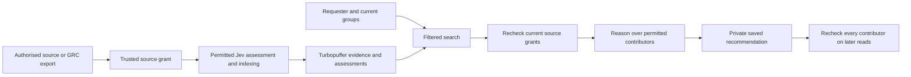

# Evidence and result permissions

28 September 2026. This document owns Crowbo's access model. The local backend supports explicit users and groups with expiring membership snapshots. Production authentication, automatic membership refresh and GRC-platform connectors are not implemented. The [backend brief](TECHNICAL-PLAN.md) owns broader implementation status.

## Product decision

Answer from the evidence the requester is allowed to use. Collection access, human readership, external model processing and permission to execute work are separate decisions. Jev can classify evidence; its answer cannot grant access.

The smallest useful granularity is an evidence record with allowed users or groups. Connectors can map a repository, channel, project or document's supported access rules onto its records. Use stable, tenant-scoped identifiers rather than display names. Groups avoid listing each team member on every document. There is no organisation-wide access fallback when an audience is unknown.

Two people asking the same question may receive different recommendations because they can use different evidence. Describe an answer as based on permitted, available evidence. Do not imply a complete company assessment or reveal the titles, counts or contents of inaccessible records. Permissions constrain retrieval before ranking; a high Jev score cannot override them.

## Reusing an existing GRC platform

Prefer a customer-authorised GRC API or export when it supplies sufficient evidence, provenance, freshness and access information. This can avoid another direct integration with every underlying system. Its broad read-only service account establishes what its collector can fetch, not what every employee may read in Crowbo. Crowbo needs its own supported authorisation to consume the platform's data. Do not reuse another application's credentials or assume access to data the platform does not expose.

For example, [Vanta describes API applications with scoped read/write permissions](https://www.vanta.com/products/vanta-api). That supports investigating an authorised integration. It does not verify that a particular endpoint exports original source ACLs, all evidence, or current user entitlements. No GRC provider or endpoint has been selected or tested for this task.

Each permitted collection needs a customer/workspace, record versions, actual observation time, permitted processors and supported audience. Use upstream per-object access where available. If the API exposes only a broad service identity, require an explicit customer-authorised mapping to a restricted audience, with recorded scope and authority. Do not label that mapping inherited source access. If neither basis exists, leave the record unavailable.

Import data relevant to the decision. A capacity question can use an authorised availability record without unrelated HR fields. An approved restricted projection is a separate evidence record with its own provenance and audience. An LLM summary does not establish that confidential input has been safely declassified.

## Enforcement through the pipeline

| Boundary | Required check |
| --- | --- |
| Import | Tenant and configured connector/workspace match. Trusted input supplies the source grant. Ingestion is an operator operation, not an MCP tool. |
| Preparation | Current permission allows the operator and relevant processor. Jev and Voyage are separate destinations. Recheck after the call before accepting its result. |
| Search | Apply user-or-group and expiry filters in Turbopuffer. Resolve chunk identifiers to current heads before disclosing text or assessments. |
| Direct inspection | Check current permission even when the caller knows the source ID. |
| Reasoning | Check every source, revision and model permission. The question/context separately requires its query-processing route. |
| Saved results and feedback | Keep creator and tenant binding, then require current access to every contributor. Revocation blocks the answer, not only its citations. |

Turbopuffer supports `ContainsAny`, `And` and `Or` in [query filters](https://turbopuffer.com/docs/query#filtering). Crowbo supplies the trusted identity and filters. Database possession of an API key is not an end-user authorisation decision.

## Local implementation

`Grant.readers` contains direct reader IDs. Optional `Grant.reader_groups` contains group IDs. Access requires a direct match or active group match, a valid source-grant period and no revocation. Processor checks apply independently. Separate reader and group fields prevent a reader named like a group from impersonating membership.

Optional `Settings.membership` contains tenant, reader, groups, check time and expiry. Validation binds the snapshot to the configured identity. Each permission check resolves active groups again. The maximum lease is one hour. Missing, expired or not-yet-valid membership grants no group access; separately valid direct grants still work.

Membership is a trusted local operator assertion, not verified human identity. CLI and stdio MCP callers cannot supply another reader or groups in a tool call. The MCP server retains startup settings, so renewing or revoking a snapshot in the settings file requires restarting it. Expiry is checked during operations. Source-grant changes are read from Turbopuffer at the existing enforcement boundaries.

Groups are bounded to 100 per snapshot and grant in this pilot. These are application bounds, not vendor limits. Do not truncate larger memberships or approximate unsupported ACL rules into broader access. Nested groups, deny rules and field restrictions need faithful resolution at the trusted integration boundary before admitting a grant.

Source access changes patch chunk permission metadata without rerunning Jev or re-embedding unchanged text. Removing one reader preserves remaining readers' access. Explicit withdrawal still withdraws the source. Legacy records without groups retain direct-reader behaviour. The added default field can make an old index grant hash require a metadata refresh through `resume`; source and assessment identities stay unchanged. The new column is introduced on writes. Refresh under the existing operator configuration before enabling group queries against an older namespace. Provider errors fail closed.

Tenant namespaces and connector/workspace checks remain in force. Saved reviews, decisions, feedback and sync scopes stay bound to their creator. Source access does not expose another user's private question, feedback or sync scope. Sharing those objects needs an explicit audience for user-supplied context; no such sharing action is implemented.

## Jev cascades and mixed audiences

Current Jev calls assess one source revision. Their answers inherit that source's current access. The larger [batching and cascade design](JEV-ENRICHMENT.md) remains proposed.

Before combining sources, each derived assessment must identify every contributing source revision and prior assessment. Its audience must satisfy all contributors, including additional context. Check the requester against each source separately. Intersecting group-name strings is insufficient: someone in both Security and Leadership can read a result derived from one record for each group.

In a synthetic example, a broadly available work item and a Leadership-only commercial commitment together explain urgency. A Security-only reader may see the work item and its standalone classification. They must not receive the combined urgency score, summary, ranking boost or cached recommendation. They may request a fresh assessment using only their permitted inputs, labelled with its narrower evidence basis.

Do not attach an attribute derived from restricted context to a more widely readable chunk. Retain contributor references and check them before using the derived scores, branches or text. A change or revocation in any contributor invalidates reuse under the previous conditions. Cache reuse must bind tenant, contributor revisions, assessment configuration and current permissions. Embedding similarity does not establish permission.

Batch independent questions only when their evidence and processing permissions are compatible. Every source sent to Jev must permit Jev; every source sent to GLM must permit that reasoning route. A Jev probability is neither a permission nor a calibrated risk probability.

## Proposed agent handoff boundary

"Continue with an agent" is a proposed sharing and delegation boundary. It is not supplied by the current startup-bound CLI/MCP identity or a saved simulated choice. [The handoff contract](DECISION-DATA-MODEL.md#proposed-agent-handoff-records) owns records; [the backend plan](TECHNICAL-PLAN.md#proposed-continuation-with-an-agent) owns the limited proof. No new source collection, connector installation, account access or live execution is authorised by this design.

Resolve the human, acting agent/service principal, organisation and destination workspace through a trusted identity route. Requested operations must satisfy the user's delegable authority, organisation policy and the destination's enforceable capabilities. The user's ability to read a decision does not confer permission to share its contributors with a different processor, publish a draft PR, change a target system or accept risk.

Before showing or delivering a private handoff, check access to the saved result itself, all contributing source revisions, user-supplied questions/corrections and any additional context. Current saved results and feedback are creator-private; sharing requires a future explicit audience/consent contract and cannot be implemented by pretending the destination is the creator. Bind consent to the actual destination, selected context and intended use. Check downstream processor routes independently, including a model or tool that receives the material after the host opens it. An unknown processing path remains unsupported for private evidence.

If the destination lacks access to any contributor, withhold the derived recommendation. Offer a separately assessed, explicitly narrower permitted case where useful; do not remove a restricted citation while retaining its conclusions, ranking or rationale. Fresh assessment and renewed review are required before that new basis can support a task. A summary is still derived evidence. Do not disclose inaccessible source titles, counts or existence through error messages or handoff previews.

Enforce target and operation scope outside the prompt through destination credentials, tool permissions, repository/environment boundaries and approval controls. Source text remains untrusted data. A requested mode must not fall back to a more permissive destination session. For example, authoring a local patch, pushing a branch, opening a PR, merging and deploying are separate operations even within "prepare a change". A live-task mode is unsupported until the selected host can enforce its scope and required approval points.

Recheck relevant evidence, policy, grants and prerequisite validity before delivery and before each consequential operation, with an explicit bounded lease and revocation mechanism at the enforcement boundary. Source freshness and unchanged fingerprints are not proof of decision validity or grant authority. If necessary prerequisites changed, pause for reassessment; do not silently regenerate an authorisation. A failed check must not create partial output containing denied material.

Prefer authenticated references resolved under current permission for private evidence. Copies and prompts already delivered to an external session cannot be recalled by Crowbo. Destination retention, downstream disclosure, cancellation and revocation behaviour must be qualified before offering private handoffs. If a host cannot enforce required invalidation, limit the offered route to an explicitly suitable scope or leave it unsupported. Asking an agent to stop is not proof that it stopped; retain the cancellation acknowledgment or unknown state. The first proposed proof uses public synthetic fixtures and grants no production access.

## Verification and production boundary

Synthetic regression cases exercise permitted and denied readers, reader/group collisions, group-only preparation, membership expiry and identity mismatch, revocation despite stale search hits, access loss during Jev inference, independent processor grants, legacy metadata refresh, private context and all-contributor checks. HTTP mocks inspect native filters and returned fields. They do not establish hosted database or identity-provider behaviour.

Before serving multiple real users, resolve authenticated identity and current tenant-scoped membership server-side on each request. Implement the selected source's audience mapping and revocation contract, including a measured maximum delay. The local one-hour lease bounds unrenewed assertions; it does not promise immediate upstream revocation. Test against the real provider and identity route. Keep provider credentials behind the backend. This increment adds no policy engine, database or service.

Previously delivered exports or provider inputs cannot be recalled by a later access check. New disclosure and processing must use the new permission state. Recommendation and execution authority remain separate under the [foundation](FOUNDATION.md).
